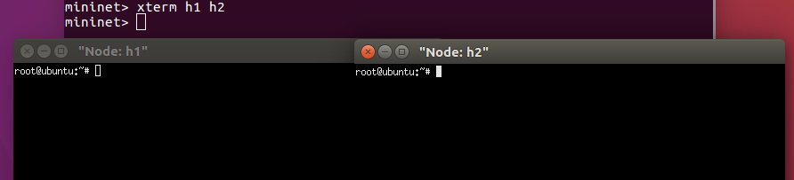

## 簡單使用Mininet練習
### 安裝 mininet
網址 : [mininet](https://github.com/mininet/mininet)   
先輸入su進入root再開始安裝   
<pre>
git clone https://github.com/mininet/mininet.git
cd mininet/util    //移動到mininet內的util資料夾
./install.sh -a    //執行安裝   -a為安裝所有套件
</pre>
### 啟動 mininet 實作
1. `mn`：啟動mininet

   
2. 開啟兩台終端機   
<pre>
xterm h1 h2
</pre>   
   
3. 兩台終端輸入`ifconfig`查看h1 h2的IP再互相ping   

   
4. 測試網頁   
h2創建一個htm，利用`python -m SimpleHTTPServer 80`建立伺服器，h1利用`curl`查看
<pre>
(h2)
echo hi > hi.htm
python -m SimpleHTTPServer 80

(h1)
curl http://10.0.0.2/hi.htm    //output會顯示hi
</pre>   
