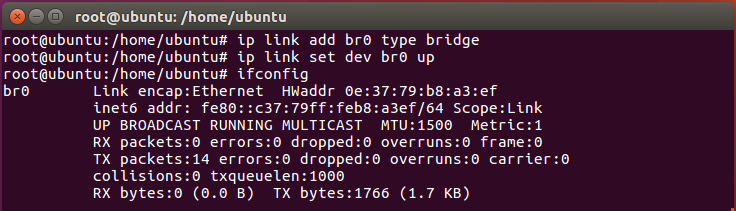
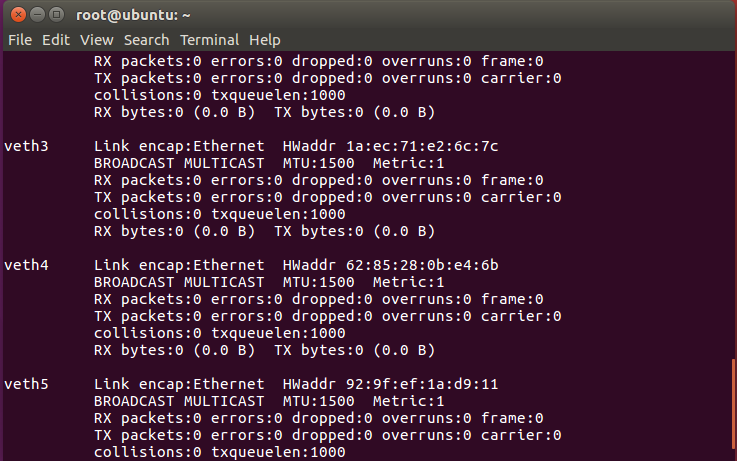
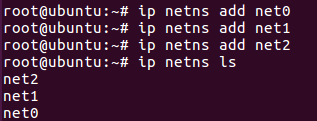
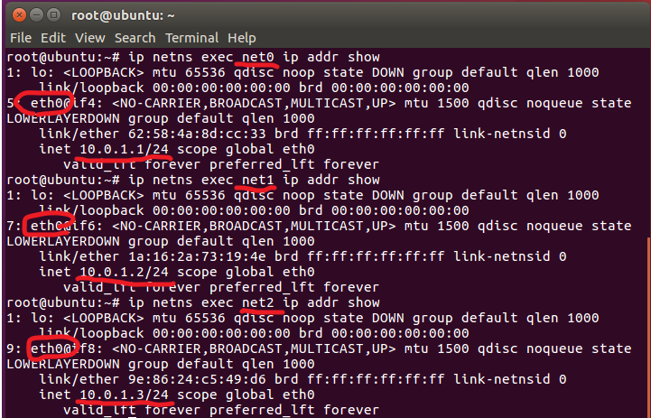
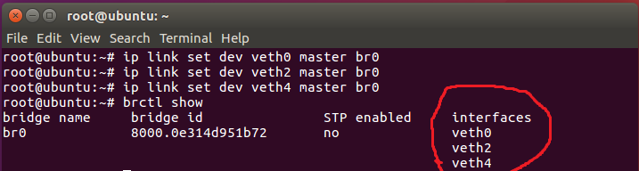
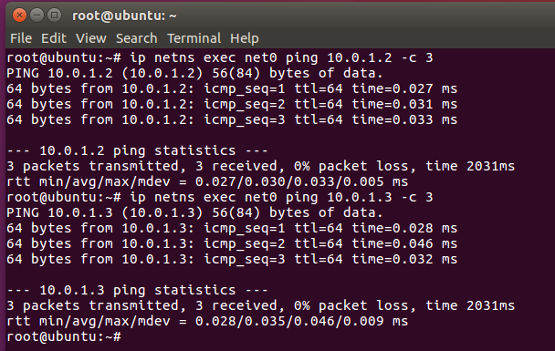
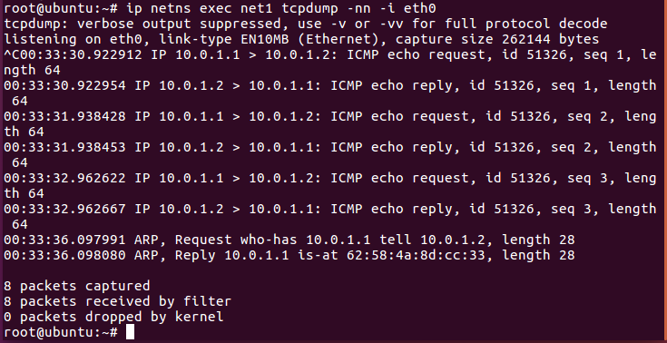
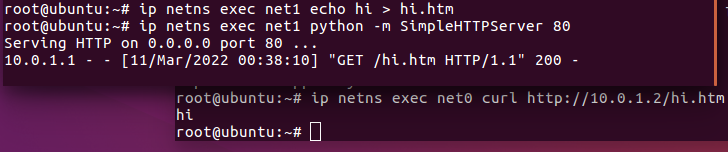
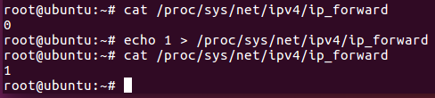

## 使用bridge套件
### 安裝bridge-utils套件
<pre>
apt install bridge-utils
</pre>
### 建立bridge   
<pre>
ip link add br0 type bridge
ip link set dev br0 up
</pre>   
建立完可以用 ifconfig 或是 brctl show 指令查看有沒有br0   
   

(目前interfaces沒有任何東西)   
   
### 創建三個veth pair   
<pre>
ip link add type veth    (輸入三次)
</pre>   
執行 ifconfig -a 指令查看有沒有三對veth  (veth0~5)   
   
### 創建三個網路空間   
<pre>
ip netns add net0
ip netns add net1
ip netns add net2
</pre>   
執行 ip netns ls 指令查看有沒有建成   
   
### 放入網卡至空間內+改名+配置IP   
<pre>
(配置第一個net0)
ip link set dev veth1 netns net0
ip netns exec net0 ip link set dev veth1 name eth0    (改名)
ip netns exec net0 ip addr add 10.0.1.1/24 dev eth0    (配置IP)
ip netns exec net0 ip link set dev eth0 up    (啟動)

(配置第二個net1)
ip link set dev veth3 netns net1
ip netns exec net1 ip link set dev veth3 name eth0
ip netns exec net1 ip addr add 10.0.1.2/24 dev eth0
ip netns exec net1 ip link set dev eth0 up

(配置第三個net2)
ip link set dev veth5 netns net2
ip netns exec net2 ip link set dev veth5 name eth0
ip netns exec net2 ip addr add 10.0.1.3/24 dev eth0
ip netns exec net2 ip link set dev eth0 up
</pre>   
執行 ip netns exec net0(1, 2) ip addr show 查看三個空間有沒有改名並配置好IP   
   
### 把veth0, 2, 4加到bridge裡面   
<pre>
ip link set dev veth0 master br0
ip link set dev veth2 master br0
ip link set dev veth4 master br0
</pre>   
執行 brctl show 查看有沒有放入br0 (interfaces有東西了)   
   
### 啟動veth
<pre>
ip link set dev veth0 up
ip link set dev veth2 up
ip link set dev veth4 up
</pre>   
ping 10.0.1.2 及 10.0.1.3   
   
   
文字版 wireshark 抓封包
<pre>
ip netns exec net1 tcpdump -nn -i eth0  //從net1空間抓eth0的封包
</pre>
   
### 從不同網路空間抓東西
在 net1 echo一個htm，再從net0空間curl抓下來   
<pre>
(net1終端)
ip netns exec net1 echo hi > hi.htm
ip netns exec net1 python -m SimpleHTTPServer 80

(net0終端)
ip netns exec net0 curl http://10.0.1.2/hi.htm
</pre>

### 啟動路由功能
<pre>
echo 1 > /proc/sys/net/ipv4/ip_forward
</pre>
使用 cat /proc/sys/net/ipv4/ip_forward 查看有沒有開啟   

---
### 參考資料   
* [详解云计算网络底层技术——Linux network namespace 原理与实践](https://segmentfault.com/a/1190000018391069)