## 用Python製作Mininet腳本
### 1. 先做兩個節點
* 1.py   
<pre>
#!/usr/bin/python

from mininet.cli import CLI
from mininet.net import Mininet
from mininet.link import Link, TCLink, Intf

if '__main__'==__name__:
    net = Mininet(link = TCLink)
    h1 = net.addHost('h1')    # 新增節點
    h2 = net.addHost('h2')
    Link(h1, h2)              # 將兩個節點連線
    net.build()
    CLI(net)
    net.stop()
</pre>   
* 程式碼完成後在終端輸入`chmod +x 1.py`變成可執行檔，再輸入`./1.py`執行   
* 輸入`net`可查看拓譜   
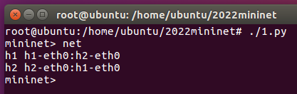   
(拓譜圖)   
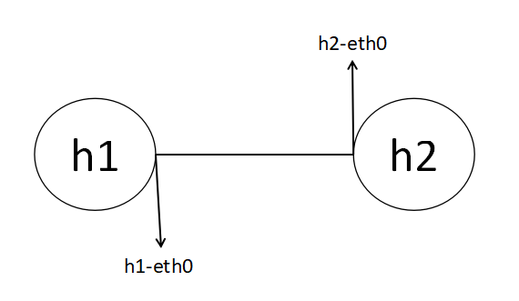   
* 輸入`xterm h1 h2`開啟兩台終端機並檢查能不能互ping
---
### 2. 更改IP (2.py)
* `ifconfig h1-eth0 0`：把舊有的IP (10.0.0.1) 先清除掉   
* `ip addr add 192.168.1.1/24 brd + dev h1-eth0`：配置IP到h1
  * `ip addr add`：新增address
  * `brd`：讓它有支援broadcast(廣播)功能   

原本1.py的腳本就可以擴增為   
<pre>
#!/usr/bin/python

from mininet.cli import CLI
from mininet.net import Mininet
from mininet.link import Link, TCLink, Intf

if '__main__'==__name__:
    net = Mininet(link = TCLink)
    h1 = net.addHost('h1')
    h2 = net.addHost('h2')
    Link(h1, h2)
    net.build()
    h1.cmd("ifconfig h1-eth0 0")
    h1.cmd("ip addr add 192.168.1.1/24 brd + dev h1-eth0")
    h2.cmd("ifconfig h2-eth0 0")
    h2.cmd("ip addr add 192.168.1.2/24 brd + dev h2-eth0")
    CLI(net)
    net.stop()
</pre>   
程式完成一樣在終端執行2.py並輸入`xterm h1 h2`，查看IP有沒有更換完成並開啟broadcast   
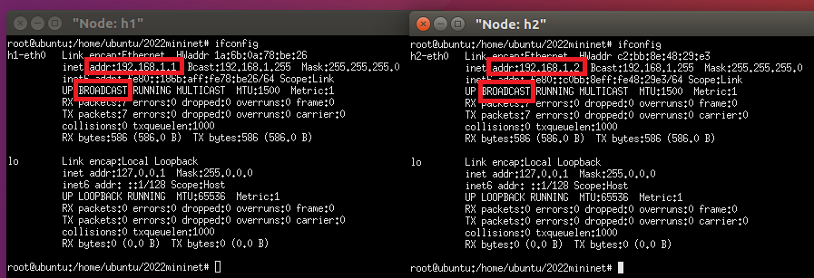

---
### 3. 創造三個節點，h1要能ping h3 (3.py)
* 拓譜圖   
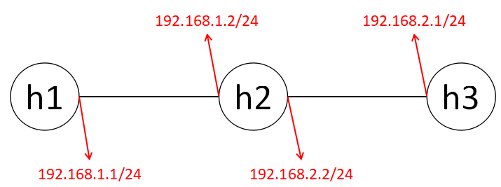   
( h1-eth0 連 h2-eth0、h2-eth1 連 h3-eth0 )   
1. 加一個 host3 `h3 = net.addHost('h3')`   
2. 讓 h2 連 h3 `Link(h2, h3)`   
3. 配置 h2-eth1 的 IP `h2.cmd("ifconfig h2-eth1 0")`、`h2.cmd("ip addr add 192.168.2.2/24 brd + dev h2-eth1")`   
4. 配置 h3-eth0 的 IP `h3.cmd("ifconfig h3-eth0 0")`、`h3.cmd("ip addr add 192.168.2.1/24 brd + dev h3-eth0")`   

看似完成了，但此時用 h1 去 ping h3 會顯示 `connect: Network is unreachable`，是因為缺少了內定路由   
* h1 輸入 `ip route add default via 192.168.1.2`：新增內定路由   
新增完後可以利用 `route -n` 查看路由表   
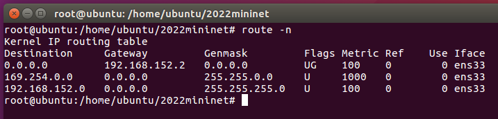   
Genmask(遮罩) 跟 Destination(目的)都是0.0.0.0，它就是內定路由
* h3 也要設定內定路由：`ip route add default via 192.168.2.2`
* 最後 h2 要把路由的功能啟動，讓它可通：`echo 1 > /proc/sys/net/ipv4/ip_forward`   

3.py 最後就擴展成   
<pre>
#!/usr/bin/python

from mininet.cli import CLI
from mininet.net import Mininet
from mininet.link import Link, TCLink, Intf

if '__main__'==__name__:
    net = Mininet(link = TCLink)
    h1 = net.addHost('h1')
    h2 = net.addHost('h2')
    h3 = net.addHost('h3')
    Link(h1, h2)
    Link(h2, h3)
    net.build()
    h1.cmd("ifconfig h1-eth0 0")
    h1.cmd("ip addr add 192.168.1.1/24 brd + dev h1-eth0")
    h2.cmd("ifconfig h2-eth0 0")
    h2.cmd("ip addr add 192.168.1.2/24 brd + dev h2-eth0")
    h2.cmd("ifconfig h2-eth1 0")
    h2.cmd("ip addr add 192.168.2.2/24 brd + dev h2-eth1")
    h3.cmd("ifconfig h3-eth0 0")
    h3.cmd("ip addr add 192.168.2.1/24 brd + dev h3-eth0")
    h1.cmd("ip route add default via 192.168.1.2")
    h3.cmd("ip route add default via 192.168.2.2")
    h2.cmd("echo 1 > /proc/sys/net/ipv4/ip_forward")

    CLI(net)
    net.stop()
</pre>   
現在 h1 就可以 ping 到 h3 了   
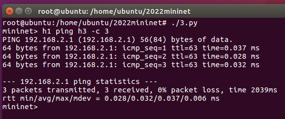   

---
### 4. 交換器與三個節點 (4.py)
* 拓譜圖   
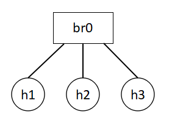    
1. 新增一個交換機 : `brctl addbr mybr`   
2. 新增 br-eth0~2 介面到 mybr 裡面：`brctl addif mybr br0-eth0`、`brctl addif mybr br0-eth1`、`brctl addif mybr br0-eth2`   
3. 啟動 mybr：`ifconfig mybr up` (沒有啟動的話連不到)   
<pre>
#!/usr/bin/python

from mininet.cli import CLI
from mininet.net import Mininet
from mininet.link import Link, TCLink, Intf

if '__main__'==__name__:
    net = Mininet(link = TCLink)
    h1 = net.addHost('h1')
    h2 = net.addHost('h2')
    h3 = net.addHost('h3')
    br0 = net.addHost('br0')
    Link(h1, br0)
    Link(h2, br0)
    Link(h3, br0)
    net.build()
    br0.cmd("brctl addbr mybr")
    br0.cmd("brctl addif mybr br0-eth0")
    br0.cmd("brctl addif mybr br0-eth1")
    br0.cmd("brctl addif mybr br0-eth2")
    br0.cmd("ifconfig mybr up")
    CLI(net)
    net.stop()
</pre>   
* 執行結果   
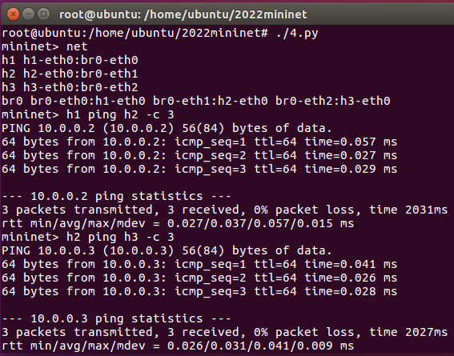   

<strong>補充重點：h1在ping h2的時候會發送ARP，br0會廣播給h2、h3詢問 Who has 10.0.0.2? Tell 10.0.0.1，h2回答之後才開始ping，此時看h1、h2、h3的wireshark，會發現只有h1跟h2會收到ping的封包，h3只會看到最一開始ARP的訊問內容。</strong>   
如果要模擬出像hub一樣，br0多加指令`brctl setageing mybr 0`，h1 ping h2的時候在h3的wireshark就會看到那些ping的封包。

---

### 5. h3竊聽h1跟h2的通訊
h3讓h1以為h2在它那個位置，也讓h2以為h1在它那個位置，可以使用arp攻擊，稱之為arpspoof。   
* 安裝：`apt install dsniff`
* 修改h1、h2、h3網卡卡號以方便辨別：   
<pre>
    h1.cmd("ifconfig h1-eth0 down")
    h1.cmd("ifconfig h1-eth0 hw ether 00:00:00:00:00:01")
    h1.cmd("ifconfig h1-eth0 up")
    h2.cmd("ifconfig h2-eth0 down")
    h2.cmd("ifconfig h2-eth0 hw ether 00:00:00:00:00:02")
    h2.cmd("ifconfig h2-eth0 up")
    h3.cmd("ifconfig h3-eth0 down")
    h3.cmd("ifconfig h3-eth0 hw ether 00:00:00:00:00:03")
    h3.cmd("ifconfig h3-eth0 up")  
</pre>   
* 現在用h1 ping h2，再用`arp -n`會看到h2的IP跟網卡   
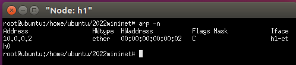   
* h3輸入`arpspoof -i h3-eth0 -t 10.0.0.1 10.0.0.2`：介面卡是h3-eth0，攻擊目標是10.0.0.1(h1)，自己(h3)偽裝成10.0.0.2(h2)。   

現在h1會看到h2的IP後面是h3的網卡，h3的wireshark會收到ping request的封包。   
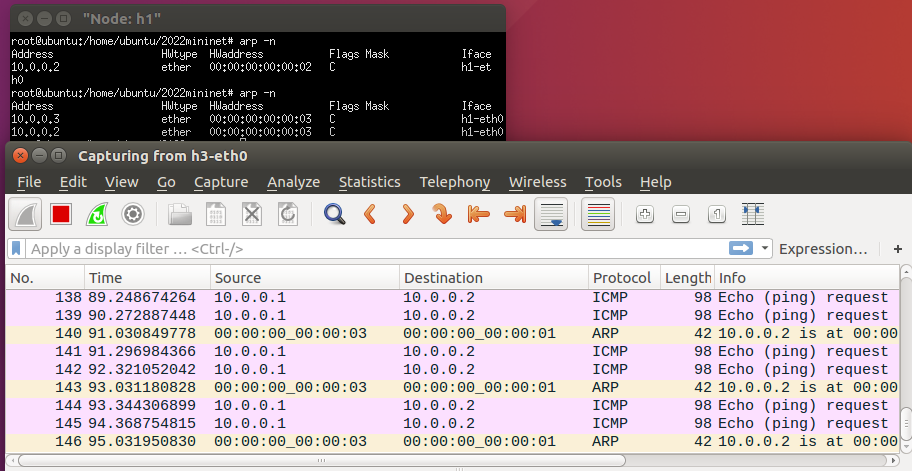   
* h3現在要騙h2說自己是h1：`arpspoof -i h3-eth0 10.0.0.2 10.0.0.1`   
* 最後h3要把路由打開：`echo 1 > /proc/sys/net/ipv4/ip_forward`就可以了   

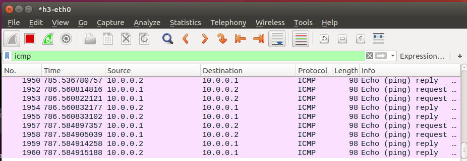   
h3可以收到request也可以reply了。   
小補充：如果用`arp -n`發現不同的IP對應到相同的卡號，代表被攻擊了。   
解決：用靜態ARP。
* h1輸入`arp -s 10.0.0.2 00:00:00:00:00:02`：給IP綁定網卡。   
* h2輸入`arp -s 10.0.0.1 00:00:00:00:00:01`   

解決   
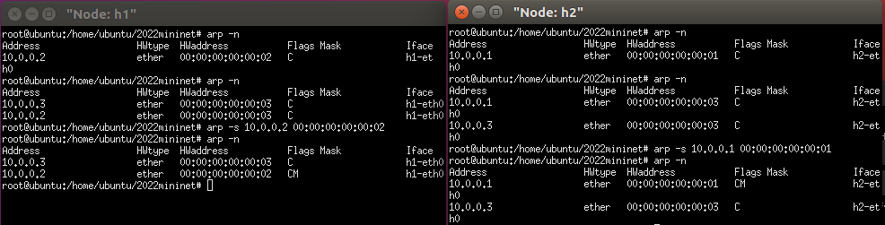   
#### 補充：ettercap使用port stealing
port stealing騙交換機(switch)。h1跟h2綁定寫死了沒辦法欺騙，但h3可以去欺騙交換機(switch)說自己就是h1、h2   
* 創建一個腳本stealing.py   
<pre>
#!/usr/bin/python

from mininet.cli import CLI
from mininet.net import Mininet
from mininet.link import Link, TCLink, Intf

if '__main__'==__name__:
  net= Mininet(link=TCLink)
  h1=net.addHost('h1')
  h2=net.addHost('h2')
  h3=net.addHost('h3')
  br0=net.addHost('br0')
  Link(h1,br0)
  Link(h2,br0)
  Link(h3,br0)
  net.build()
  br0.cmd("brctl addbr mybr")
  br0.cmd("brctl addif mybr br0-eth0")
  br0.cmd("brctl addif mybr br0-eth1")
  br0.cmd("brctl addif mybr br0-eth2")
  br0.cmd("ifconfig mybr up")
  h1.cmd("ifconfig h1-eth0 0")
  h1.cmd("ip addr add 192.168.10.1/24 brd + dev h1-eth0")
  h1.cmd("ifconfig h1-eth0 hw ether 00:00:00:00:00:01")
  h2.cmd("ifconfig h2-eth0 0")
  h2.cmd("ip addr add 192.168.10.2/24 brd + dev h2-eth0")
  h2.cmd("ifconfig h2-eth0 hw ether 00:00:00:00:00:02")
  h3.cmd("ifconfig h3-eth0 0")
  h3.cmd("ip addr add 192.168.10.3/24 brd + dev h3-eth0")
  h3.cmd("ifconfig h3-eth0 hw ether 00:00:00:00:00:03")
  CLI(net)
  net.stop()
</pre>   
* 執行後開啟h1、h2、h3、h3終端，先用h1 ping h2，再到第一個h3打開wireshark查看會看到是收不到ping封包的   
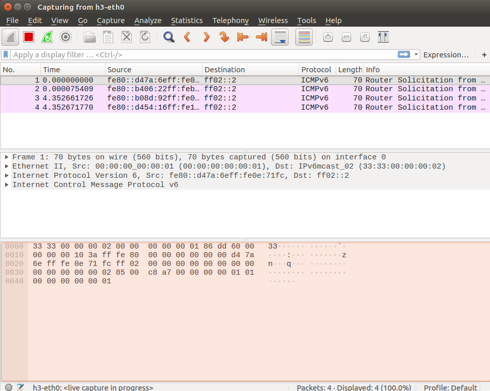   
* 到第二個h3輸入`ettercap -G`開啟ettercap圖形化介面，-G就是Graphical   
* 右上角打勾   
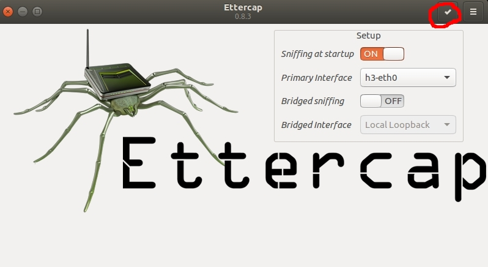   
* 右上角Hosts裡面選擇"Scan for hosts"   
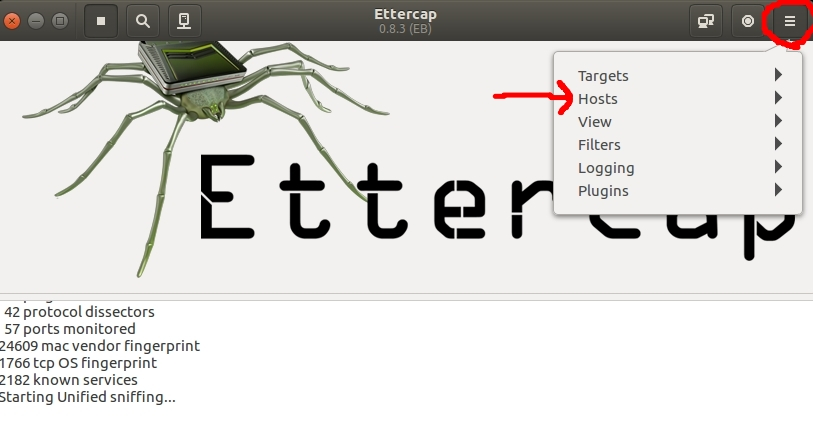   
* 跑完後一樣點進Hosts裡，這次選擇Hosts list看到下面畫面。點擊第一個IP選Add to Target1、第二個IP選Add to Target 2   
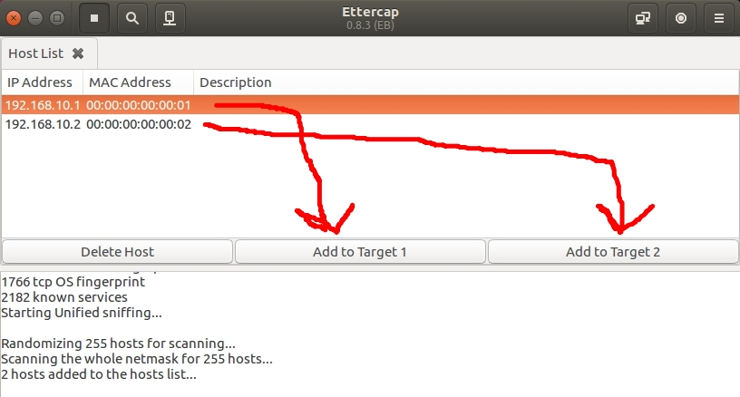   
* 右上角圖案選擇Port stealing...
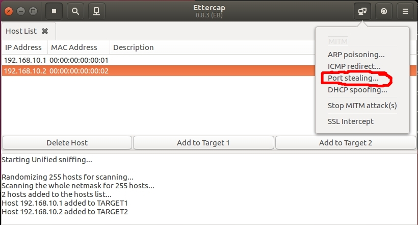   
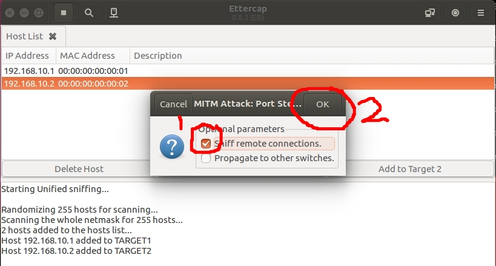   
* 最後查看h3的wireshark   
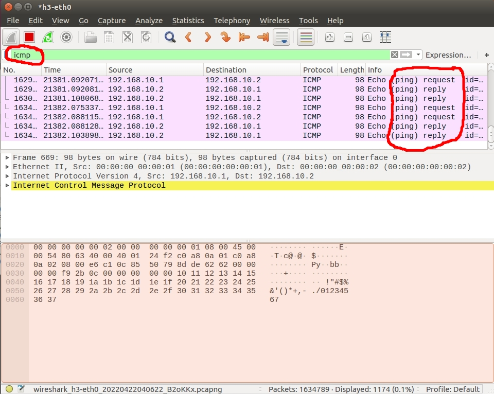   
#### 防範
Cisco交換機可以綁定網路卡卡號的埠，如果是其它網路卡送資料進去，交換機就會把那個port擋住；很便宜的交換機就沒辦法。   

---
### 練習
* 拓譜圖   
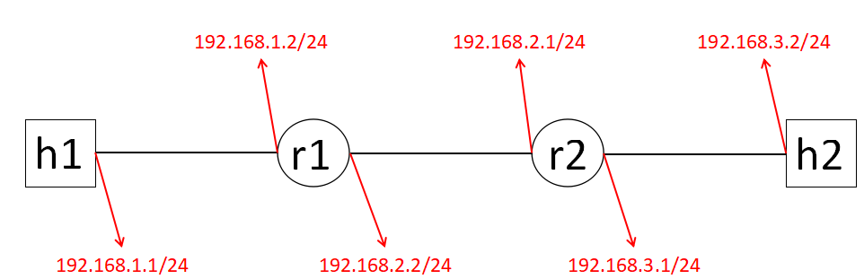   
讓 h1 能 ping 到h2   
<pre>
#!/usr/bin/python

from mininet.cli import CLI
from mininet.net import Mininet
from mininet.link import Link, TCLink, Intf

if '__main__'==__name__:
    net = Mininet(link = TCLink)
    h1 = net.addHost('h1')
    h2 = net.addHost('h2')
    r1 = net.addHost('r1')
    r2 = net.addHost('r2')
    Link(h1, r1)
    Link(r1, r2)
    Link(r2, h2)
    net.build()
    h1.cmd("ifconfig h1-eth0 0")
    h1.cmd("ip addr add 192.168.1.1/24 brd + dev h1-eth0")
    r1.cmd("ifconfig r1-eth0 0")
    r1.cmd("ip addr add 192.168.1.2/24 brd + dev r1-eth0")
    r1.cmd("ifconfig r1-eth1 0")
    r1.cmd("ip addr add 192.168.2.2/24 brd + dev r1-eth1")
    r2.cmd("ifconfig r2-eth0 0")
    r2.cmd("ip addr add 192.168.2.1/24 brd + dev r2-eth0")
    r2.cmd("ifconfig r2-eth1 0")
    r2.cmd("ip addr add 192.168.3.1/24 brd + dev r2-eth1")
    h2.cmd("ifconfig h2-eth0 0")
    h2.cmd("ip addr add 192.168.3.2/24 brd + dev h2-eth0")
    h1.cmd("ip route add default via 192.168.1.2")
    r1.cmd("ip route add default via 192.168.2.1")
    r2.cmd("ip route add default via 192.168.2.2")
    h2.cmd("ip route add default via 192.168.3.1")
    r1.cmd("echo 1 > /proc/sys/net/ipv4/ip_forward")
    r2.cmd("echo 1 > /proc/sys/net/ipv4/ip_forward")

    CLI(net)
    net.stop()
</pre>   
* 執行結果   
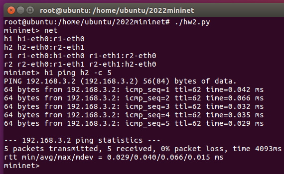   
---