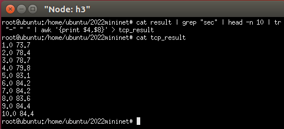
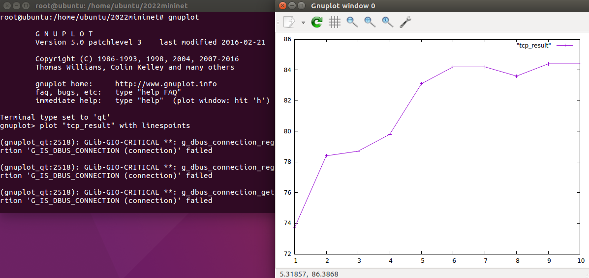

## miniedit、iperf、gnuplot
### 1. miniedit.py
路徑/home/ubuntu/mininet/examples裡面有個miniedit.py，終端輸入`python miniedit.py`執行它   
   
這個可以設置視覺化拓譜，在線上按滑鼠右鍵也可以設定它的連線的細節訊息，如果沒有設定就是看你系統跑多快它就跑多快。   
   
設定完成後可以匯出成python檔   
   
之後再到存放的路徑打開來看，會看到它自動編程好了。但不一定會完全符合需求，而且看起來有點複雜，因為mininet除了能做傳統網路應用，也可以做軟體定義網路。不過優點就是有些語法不知道怎麼設，它就自動幫你打好了。   
   

---
### 2. 效能量測工具iperf
用iperf可以看看從一個節點送東西到另一個節點能送多快，有些資料可能由新的路徑去傳，就可以用iperf看有沒有傳比較快。它有支援TCP跟UDP的傳輸。終端輸入`apt install iperf`安裝。
>小補充：接收端叫做server；傳送端叫做client。   
#### (1). 實驗(TCP)
* 執行3.py並開啟h1、h3，由h3當作伺服器(server)、h1當客戶端(client)   
* h3終端輸入`iperf -s -i 1`：-s是server的意思、-i是interval的意思，-i 1也就是每隔1秒統計吞吐量是多少。如果沒有加其它參數，預設就是用TCP。   
   
* h1終端輸入`iperf -c 192.168.2.1 -t 10`：-c就是client、192.168.2.1是server端的IP、-t是time，-t 10就是傳送10秒的意思。   
   
* 執行完在h3(server)就會顯示每秒的平均頻寬，以及最後一列會顯示0~10秒平均頻寬   
   
#### (2). 實驗(UDP)
* 一樣h3當作伺服器(server)、h1當客戶端(client)   
* 在h3指令多加一個參數`-u`而已，執行後會看到使用UDP   
   
* 這時候多開一個h1、h3（總共四個視窗），在新的h3設不同埠號，參數為`-p`，完整指令為`iperf -s -i 1 -u -p 6666`，這樣就不會跟原本的埠號(5001)衝突了   
   
* 再到h1輸入`iperf -c 192.168.2.1 -u -b 100M -t 100`：-u就是UDP、-b是設定頻寬 為100M   
* 因為h1沒有設定目標埠號，所以預設是5001會收到，且Bandwidth基本上都是100   
   
* 再到另一個h1設定目標埠號6666並把頻寬改成200M執行，`iperf -c 192.168.2.1 -u -b 200M -t 100 -p 6666`   
* 6666埠號的h3就會收到了，Bandwidth基本上也是在200   
   
> 如果兩個h1同時發送且沒有指定埠號，5001 server的Bandwidth就會一下顯示100一下顯示200   
#### (3) 修改3.py
* 複製3.py，把檔名改成3-1.py   
* 加上這段程式碼進行網路設定：`bw`→頻寬、`delay`→延遲、`loss`→遺失率   
<pre>
    h1h2 = {'bw':100,'delay':'1ms','loss':0}
    net.addLink(h1, h2, cls=TCLink , **h1h2)
    h3h2 = {'bw':100,'delay':'1ms','loss':0}
    net.addLink(h3, h2, cls=TCLink , **h3h2)
</pre>   
整段3-1.py程式碼就變成   
<pre>
#!/usr/bin/python

from mininet.cli import CLI
from mininet.net import Mininet
from mininet.link import Link, TCLink, Intf

if '__main__'==__name__:
    net = Mininet(link = TCLink)
    h1 = net.addHost('h1')
    h2 = net.addHost('h2')
    h3 = net.addHost('h3')

    h1h2 = {'bw':100,'delay':'1ms','loss':0}
    net.addLink(h1, h2, cls=TCLink , **h1h2)
    h3h2 = {'bw':100,'delay':'1ms','loss':0}
    net.addLink(h3, h2, cls=TCLink , **h3h2)

    net.build()
    h1.cmd("ifconfig h1-eth0 0")
    h1.cmd("ip addr add 192.168.1.1/24 brd + dev h1-eth0")
    h2.cmd("ifconfig h2-eth0 0")
    h2.cmd("ip addr add 192.168.1.2/24 brd + dev h2-eth0")
    h2.cmd("ifconfig h2-eth1 0")
    h2.cmd("ip addr add 192.168.2.2/24 brd + dev h2-eth1")
    h3.cmd("ifconfig h3-eth0 0")
    h3.cmd("ip addr add 192.168.2.1/24 brd + dev h3-eth0")
    h1.cmd("ip route add default via 192.168.1.2")
    h3.cmd("ip route add default via 192.168.2.2")
    h2.cmd("echo 1 > /proc/sys/net/ipv4/ip_forward")

    CLI(net)
    net.stop()
</pre>   
* 這次設定頻寬100M，再次使用TCP連線實驗，看到Bandwidth大概80左右，比剛剛第一次的TCP實驗還高   
   
---
### 3. gnuplot繪圖分析
#### 結果輸出
上述的實驗做出來，要一行一行看終端的解析數據會很辛苦，所以直接把圖畫出來就可以一目了然又輕鬆。   
* `iperf -s -i 1 > result`先把結果放到一個檔案(result)，到時候用這個檔案來做資料處理   
* `iperf -s -i 1 | tee result`這段指令可以邊把執行結果印出來，邊把它輸出到result裡面   
* 把result印出來就會出現以下結果   
   

傳完之後主要是要資料中的時間(Interval)跟吞吐量(Bandwidth)來當圖中的X軸跟Y軸   
* `cat result | grep "sec" | head -n 10 | tr "-" " " | awk '{print $4,$8}' > tcp_result`
    * `grep "sec"`：過濾出只有sec的列，最上面的Interval、Transfer、Bandwidth還有其他資訊就不會印出來   
    * `head -n 10`：印出前面10行   
    * `tr "-" " "`：因為上面資料的行數是由空格來分開的，而在9.0-10.0秒的時候沒有分開 是一個資料(第三行)，就跟上面其它秒數不一樣了，這指令就是把 - 符號變成空白，這樣分行就一致了   
    * `awk '{print $4,$8}'`：印出第四行跟第八行   
    * `> tcp_result`：把結果輸出到tcp_result   

tcp_result印出來就會看到已經單獨得到時間(Interval)跟吞吐量(Bandwidth)了   
   
#### 繪圖
* 在目錄終端輸入`gnuplot`即可進入gnuplot模式   
* `plot "tcp_result" with linespoints`：用線+點的方式把tcp_result檔案畫出來，也可以設定用"點(points)"或是"線(lines)"來畫   
   
* 把這圖表做調整   
    * `set xlabel "time (sec)"`：設定x軸名稱   
    * `set ylabel "throughput (Mbps)"`：設定y軸名稱   
    * `set yrange [0:100]`：設定y軸顯示數值為0~100   
    * `set ytics 0,10,100`：設定y軸從0到100之間每10劃一格   
    * 設定x軸的顯示方式跟上述y軸一樣，依需求自己設定   
    * `set title "TCP Flow Throughput"`：設定圖表標籤   
    * `replot`：重新繪圖    
       
    * `set terminal gif`：設定成gif圖檔   
    * `set output "a.gif"`：設定檔名輸出   
    * `replot`：重新繪圖   
    * 到資料夾裡面會看到一個剛剛繪出來的a.gif   
       
#### 寫成腳本
`gedit tcp.plt`創建空白plt(檔名自訂)，再把上面的指令打進去   
`gnuplot tcp.plt`：執行它，就會自動再把它畫出來   
再到資料夾裡面看，就看到新的gif了   
   
以後畫圖要改動小地方，就可以直接在腳本改動，不用再一直輸入指令了   
#### 兩條資料流
執行3-1.py，開啟兩個h1、h3，一組用TCP，另一組用UDP   
* 一個h3執行`iperf -s -i 1 -p 6666 | tee tcp`   
* 另一個h3執行`iperf -s -i 1 -u -p 7777 | tee udp`   
* 一個h1輸入`iperf -c 192.168.2.1 -t 50 -p 6666`   
* 另一個h1輸入`iperf -c 192.168.2.1 -u -b 50M -t 30 -p 7777`   
* 接下來讓UDP的h1先啟動，再馬上啟動TCP的   
* 跑完後跟上面一樣把資料過濾只留下要看的，`cat tcp | grep "sec" | head -n 50 | tr "-" " " | awk '{print $4,$8}' > tcp_result`   
  * 但是UDP那邊可能會有顯示out-of-order，因為發生先傳的後到、後傳的先到的狀況，就要用到`grep -v`指令，這指令意思是排除在外，指令擴展成`cat udp | grep "sec" | grep -v "out-of-order" | head -n 30 | tr "-" " " | awk '{print $4,$8}' > udp_result`   
* 最後就得到一個tcp_result跟udp_result   

改寫腳本   
<pre>
plot "tcp_result" with linespoints, "udp_result" with linespoints       //新增udp_result
set xlabel "time (sec)"
set ylabel "throughput (Mbps)"
set yrange [0:100]
set ytics 0,10,100
set xrange [1:50]       //tcp測試到50秒 所以x軸畫到50
set xtics 0,10,50
set title "TCP/UDP Flow Throughput"
set terminal gif
set output "tcp_udp.gif"
replot
</pre>   
再次用`gnuplot tcp.plt`執行該腳本，生成tcp_udp.gif圖檔   
   

---