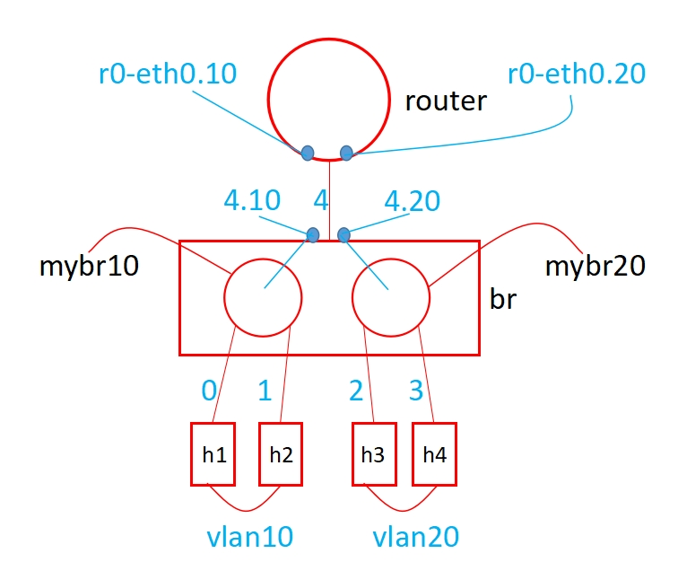

## 網路程式設定、動態繪圖、Linux核心
### 1. bw、delay、loss
3-1.py   
```
#!/usr/bin/python

from mininet.cli import CLI
from mininet.net import Mininet
from mininet.link import Link, TCLink, Intf

if '__main__'==__name__:
    net = Mininet(link = TCLink)
    h1 = net.addHost('h1')
    h2 = net.addHost('h2')
    h3 = net.addHost('h3')
    h1h2 = {'bw':100,'delay':'1ms','loss':0}
    net.addLink(h1, h2, cls=TCLink , **h1h2)
    h3h2 = {'bw':100,'delay':'1ms','loss':0}
    net.addLink(h3, h2, cls=TCLink , **h3h2)
    net.build()
    h1.cmd("ifconfig h1-eth0 0")
    h1.cmd("ip addr add 192.168.1.1/24 brd + dev h1-eth0")
    h2.cmd("ifconfig h2-eth0 0")
    h2.cmd("ip addr add 192.168.1.2/24 brd + dev h2-eth0")
    h2.cmd("ifconfig h2-eth1 0")
    h2.cmd("ip addr add 192.168.2.2/24 brd + dev h2-eth1")
    h3.cmd("ifconfig h3-eth0 0")
    h3.cmd("ip addr add 192.168.2.1/24 brd + dev h3-eth0")
    h1.cmd("ip route add default via 192.168.1.2")
    h3.cmd("ip route add default via 192.168.2.2")
    h2.cmd("echo 1 > /proc/sys/net/ipv4/ip_forward")

    CLI(net)
    net.stop()
```   
1. <strong>bw (bandwidth頻寬)</strong>：傳輸媒介的最大吞吐量(throughput)。   
2. <strong>delay(延遲)</strong>：一個封包從來源端送出後，到目的端接收到這個封包，中間所花的時間。由下圖可以看到h1 ping h3中間至少經過4ms才會回到h1，因為中間還有其它的延遲所以更久。   
   * <strong>propagation delay(傳遞延遲)</strong>：將資料傳送到router的時間成本，距離有關，距離越長延遲越久。   
   * <strong>queuing delay(佇列等待)</strong>：一個點傳到另一個點之間，輸出會有一個佇列，如果有很多的資料在裡面排隊傳送，中間等待的時間成本就是queuing delay。   
   * <strong>processing time(處理時間)</strong>：解讀packet header並解決定此packet map到特定link的時間就是processing delay。    
3. <strong>loss(遺失率)</strong>：對多媒體資料傳送的時候，遺失率會影響很大。就算設定0%也不一定100%保留，網路傳輸的queue如果滿了，封包就會被丟棄。   

   
現在delay都設定1ms，各種delay加起來，ping回來就會大於預計的4ms，至少都會比4ms久。   
   
在h1跟h2之間遺失率設10%，假如h1 ping 1000個封包到h2，成功率會在81%左右，計算方式 (1-0.1)x1x1x(1-0.1)=0.9x0.9=0.81：第一個1-0.1為h1傳到h2、第二個1-0.1為h2回傳到h1，失敗率為 1-0.81=0.19，約為19%。   
* h1終端輸入`ping -i 0.01 -c 1000 192.168.2.1`   
  * -i：interval，每0.01秒發一個才不會等太久。   

第一次執行可能不會是19%，理論上執行越多次，失敗率會越接近19%。   
   
假設h1h2遺失率設5%，成功率為 (1-0.05)x1x1x(1-0.05)=0.95x0.95=0.9，失敗率為 1-0.9=0.1，約為10%。   

---
### 2. 一邊一邊傳資料，一邊把圖畫出來
* 執行3-1.py，h1 ping h3，用iperf把結果輸出成a檔案。   
* 建立proccess.sh，程式打完可以輸入`sed -i '/^$/d' process.sh`把空白行刪掉。
  * `sed -i`：stream editor資料流編輯器，-i：直接修改讀取的檔案內容，而不是由螢幕輸出，沒有加-i只會顯示變更結果，不會對檔案有任何變化。   
  * `/^$/`：兩個斜線是匹配的意思，^為以...為開頭；$為以...為結尾，兩種符號連在一起中間沒東西就是空白。   
  * `d`：刪除。   
```
filename='a'
> result
> a
b="not"
while true
do
   if [ -s "$filename" ]     # 檢查檔案有沒有資料
   then
        #echo "$filename is NOT empty file."
        while IFS= read -r line         # 讀取每一行
        do
          result=`echo "$line" | grep "sec"`        # 進行過濾，有sec的資料開始處理並存到result的變數
          if [[ -n $result ]]         # 判斷result有沒有內容
          then  
            #echo $result
            b="done"        # result有內容，b等於done
            break
          fi
        done < a
   fi
 
   if [ $b = "done" ]
   then
     break
   fi
done
 
while IFS= read -r line
do
  result=`echo "$line" | grep "sec" | tr "-" " " | awk '{print $4,$8}'`
  if [[ -n $result ]]
  then
    echo $result          # 會在執行process.sh的h3顯示過濾的結果
    echo $result >> result          # 把過濾後的東西丟到result
    sleep 1
  fi
done < a
```   
用這方式，a裡面的資料會不斷產生出來，處理的結果也會立即丟到result，最後根據result做繪圖。   
* 建立gnuplot.plt   

```
FILE = 'result'
stop = 0
 
N = 50
set yrange [0:100]
set ytics 0,10,100
set key off
set xlabel "time(sec)"
set ylabel "Throughput(Mbps)"
 
while (!stop) {  
    pause 0.5       # pause in seconds
    stats [*:*][*:*] FILE u 0 nooutput
    lPnts=STATS_records<N ? 0: STATS_records-N
    plot FILE u 1:2 every ::lPnts w lp pt 7         # 使用result裡面第1個及第2個column畫圖
}
```   
* 建立plot-throughput.sh   
```
filename='result'
while true
do
   if [ -s "$filename" ]          # 檢查result有沒有東西，沒東西就會一直跑while
   then
        #echo "$filename is NOT empty file."
        break
   fi
done
 
gnuplot gnuplot-plot          # result有東西，break出來執行gnuplot-plot畫圖
```   
* 讓這三個檔案有執行權限：`chmod +x {檔名}`。   
* 開啟h1、h3、h3、h3，每個h3分別執行`./process.sh`、`./plot-throughput.sh`、`iperf -s -i 1 > a`，h1執行`iperf -c 192.168.2.1 -t 1000`，開始邊傳邊畫圖。   
   

---
### 2. Mininet做vlan
* 終端輸入`modprobe 8021q`將模組載入到kernel。   
* 輸入`lsmod`：查看目前已經加入到核心的模組有哪些。   
  * 移除模組：`rmmod {模組名稱}`   
* 創建程式檔。   
```
#!/usr/bin/env python
from mininet.cli import CLI
from mininet.net import Mininet
from mininet.link import Link,TCLink,Intf

if '__main__' == __name__:
  net = Mininet(link=TCLink)
  h1 = net.addHost('h1')
  h2 = net.addHost('h2')
  h3 = net.addHost('h3')
  h4 = net.addHost('h4')
  br1 = net.addHost('br1')
  r1 = net.addHost('r1')
  net.addLink(h1, br1)
  net.addLink(h2, br1)
  net.addLink(h3, br1)
  net.addLink(h4, br1)
  net.addLink(br1,r1)
  net.build()
  h1.cmd("ifconfig h1-eth0 0")
  h2.cmd("ifconfig h2-eth0 0")
  h3.cmd("ifconfig h3-eth0 0")
  h4.cmd("ifconfig h4-eth0 0")
  r1.cmd("ifconfig r1-eth0 0")
  br1.cmd("ifconfig br1-eth0 0")
  br1.cmd("ifconfig br1-eth1 0")
  br1.cmd("ifconfig br1-eth2 0")
  br1.cmd("ifconfig br1-eth3 0")
  br1.cmd("ifconfig br1-eth4 0")
  br1.cmd("vconfig add br1-eth4 10")
  br1.cmd("vconfig add br1-eth4 20")
  r1.cmd("vconfig add r1-eth0 10")
  r1.cmd("vconfig add r1-eth0 20")
  br1.cmd("brctl addbr mybr10")
  br1.cmd("brctl addbr mybr20")
  br1.cmd("brctl addif mybr10 br1-eth0")
  br1.cmd("brctl addif mybr10 br1-eth1")
  br1.cmd("brctl addif mybr10 br1-eth4.10")
  br1.cmd("brctl addif mybr20 br1-eth2")
  br1.cmd("brctl addif mybr20 br1-eth3")
  br1.cmd("brctl addif mybr20 br1-eth4.20")
  br1.cmd("ifconfig br1-eth4.10 up")
  br1.cmd("ifconfig br1-eth4.20 up")
  r1.cmd("ifconfig r1-eth0.10 up")
  r1.cmd("ifconfig r1-eth0.20 up")
  br1.cmd("ifconfig mybr10 up")
  br1.cmd("ifconfig mybr20 up")
  r1.cmd('ifconfig r1-eth0.10 192.168.10.254 netmask 255.255.255.0')
  r1.cmd('ifconfig r1-eth0.20 192.168.20.254 netmask 255.255.255.0')
  r1.cmd("echo 1 > /proc/sys/net/ipv4/ip_forward")
  h1.cmd("ip address add 192.168.10.1/24 dev h1-eth0")
  h1.cmd("ip route add default via 192.168.10.254")
  h2.cmd("ip address add 192.168.10.2/24 dev h2-eth0")
  h2.cmd("ip route add default via 192.168.10.254")
  h3.cmd("ip address add 192.168.20.1/24 dev h3-eth0")
  h3.cmd("ip route add default via 192.168.20.254")
  h4.cmd("ip address add 192.168.20.2/24 dev h4-eth0")
  h4.cmd("ip route add default via 192.168.20.254")
  CLI(net)
  net.stop()
```   
   
* 執行檔案並測試vlan10裡面的host ping到vlan20的host。   

---
### 3. Linux核心
#### 簡短介紹
linux裡面會有一些驅動程式，並沒有在做核心的時候直接編譯在裡面，而是採用模組化設計，也就是有需要的時候再載入，好處是核心不會那麼大。   
* linux的核心在/boot資料夾，終端輸入`cd /boot`進去查看，可以看到vmlinuz-4.15.0-142等等，這就是一個kernel：版本4.15.0、修改過142次，每一次修改都會產生一次新的核心。   
   
* 終端輸入`ls -lh vmlinuz-4.15.0-*`
  * `-lh`：長格式並使用熟悉的單位顯示檔案大小。   
     

這樣看下來會發現linux的核心都很小，所以可以載入到嵌入式的環境裡面。   
#### 核心編譯
* 安裝套件
```
apt-get install gcc make libncurses5-dev openssl libssl-dev
apt-get install build-essential
apt-get install pkg-config
apt-get install libc6-dev
apt-get install bison
apt-get install flex
apt-get install libelf-dev
```
* 到 [Linux核心官網](https://www.kernel.org/)選擇長期維護版(longterm)或是穩定版(stable)複製網址，到終端機使用wget指令抓下來。   
```
wget https://cdn.kernel.org/pub/linux/kernel/v5.x/linux-5.15.37.tar.xz
```
* 解壓縮   
```
tar xfJ linux-5.15.37.tar.xz
```
* 解壓完看看kernel資料夾裡面有啥
  * `arch`：architecture架構，裡面有x86，或是arm(樹梅派、arduino)還有很多不同CPU架構，代表linux支援很多架構。   
  * `fs`：file system檔案系統，linux也可以支援很多檔案系統(ext4、xfs、fat32)。   
  * `mm`：memory management記憶體管理，有關記憶體的配置都放在這裡。   
  
   


* 查看現在使用的核心
```
uname -r
```
   
* 終端輸入`cp /boot/config-4.15.0-142-generic .config`：拿現在核心編譯的基本配置，當作針對新核心的預設配置。   
* 終端輸入`make menuconfig`：微調config。看到M表示它是模組；看到*表示它很重要，一定要編譯進去kernel。   
   
* 編譯完後Exit退出介面，最後輸入`make`開始編譯。   


---
### 參考資料
* [學習網路五層](https://ithelp.ithome.com.tw/articles/10205005)   
* [sed 命令簡介](https://dywang.csie.cyut.edu.tw/dywang/linuxProgram/node42.html)   
* [Linux設定vlan](https://puremonkey2010.blogspot.com/2011/11/linux-vconfig-vlan.html)   
* [編譯Linux核心](https://www.796t.com/content/1548585199.html)   