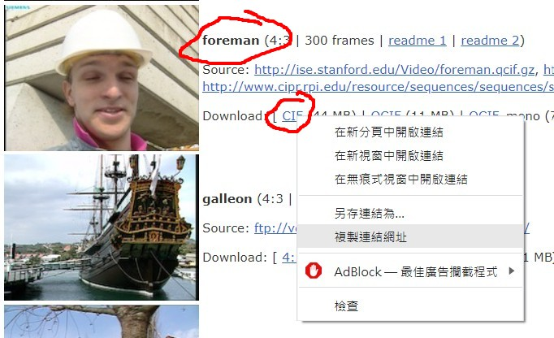
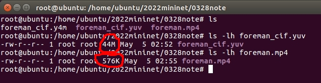
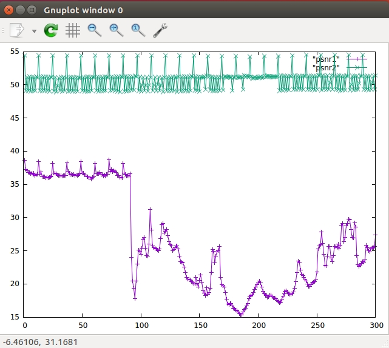
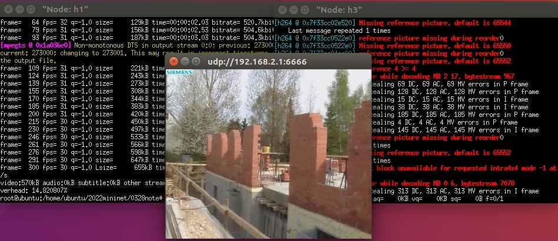
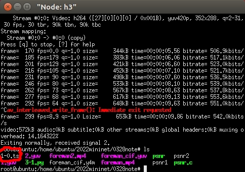
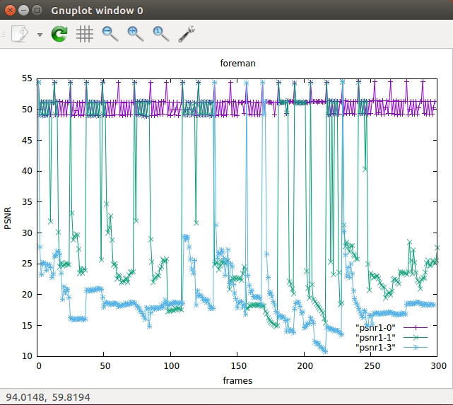

##
### 1. FFMPEG實驗
#### 壓縮
* 安裝套件`apt install ffmpeg`。   
* 到[這裡](https://media.xiph.org/video/derf/)挑了一個foreman實驗。   
   
* 用wget指令抓下來。   
```
wget https://media.xiph.org/video/derf/y4m/foreman_cif.y4m
```   
* 輸入`ffmpeg -i foreman_cif.y4m foreman_cif.yuv`進行轉換。   
* `ffmpeg -f rawvideo -s:v 352x288 -r 30 -i foreman_cif.yuv -c:v libx264 -qp 30 -g 12 -bf 2 -f mpeg foreman.mp4`進行壓縮。qp設10的話壓縮出來的檔案大小會比較大，也就是qp越高，檔案壓縮越大，大小越小。   
* 查看壓縮後兩個檔案大小，確實變小了。   
```
ls -lh foreman_cif.yuv
ls -lh foreman.mp4
```   
   
* 現在再壓縮一個qp為10的影片出來並命名為foreman2，`ffmpeg -f rawvideo -s:v 352x288 -r 30 -i foreman_cif.yuv -c:v libx264 -qp 10 -g 12 -bf 2 -f mpeg foreman2.mp4`。   
* 把1跟2播放出來看看差別。   
```
ffplay foreman.mp4
ffplay foreman2.mp4
```   
* 創建psnr.c程式。   
```
#include <math.h>
#include <stdio.h>
#include <stdlib.h>
#include <string.h>
#include <time.h>
int main(int n, char *cl[])
{
  FILE *f1, *f2;
  int i, x, y, yuv, inc = 1, size = 0, N = 0, Y, F;
  double yrmse, diff, mean = 0, stdv = 0, *ypsnr = 0;
  unsigned char *b1, *b2;
  int k=1;
  clock_t t = clock();
  if (n != 6 && n != 7) {
    puts("psnr x y <YUV format> <src.yuv> <dst.yuv> [multiplex]");
    puts("  x\t\tframe width");
    puts("  y\t\tframe height");
    puts("  YUV format\t420, 422, etc.");
    puts("  src.yuv\tsource video");
    puts("  dst.yuv\tdistorted video");
    puts("  [multiplex]\toptional");
    return EXIT_FAILURE;
  }
  if ((f1 = fopen(cl[4],"rb")) == 0) goto A;
  if ((f2 = fopen(cl[5],"rb")) == 0) goto B;
  if (!(x = strtoul(cl[1], 0, 10)) ||
      !(y = strtoul(cl[2], 0, 10))) goto C; 
  if ((yuv = strtoul(cl[3], 0, 10)) > 444) goto D;
  if (cl[6] && !strcmp(cl[6], "multiplex")) inc = 2;
  Y = x * y;
  switch (yuv) {
    case 400: F = Y; break;
    case 422: F = Y * 2; break;
    case 444: F = Y * 3; break;
    default :
    case 420: F = Y * 3 / 2; break;
  }
  if (!(b1 = malloc(F))) goto E;
  if (!(b2 = malloc(F))) goto E;
  for (;;) {
    if (1 != fread(b1, F, 1, f1) || 1 != fread(b2, F, 1, f2)) break;
    for (yrmse=0, i=inc-1; i<(inc==1 ? Y : F); i+=inc) {
      diff = b1[i] - b2[i];
      yrmse += diff * diff;
    }
    if (++N > size) {
      size += 0xffff;
      if (!(ypsnr = realloc(ypsnr, size * sizeof *ypsnr))) goto E;
    }
    mean += ypsnr[N-1] = yrmse ? 20 * (log10(255 / sqrt(yrmse / Y))) : 0;
    printf("%d\t%.2f\n", k++, ypsnr[N-1]);
  }
  if (N) {
    mean /= N;
    for (stdv=0, i=0; i<N; i++) {
      diff = ypsnr[i] - mean;
      stdv += diff * diff;
    }
    stdv = sqrt(stdv / (N - 1));
    free(ypsnr);
  }
  fclose(f1);
  fclose(f2);
  //fprintf(stderr, "psnr:\t%d frames (CPU: %lu s) mean: %.2f stdv: %.2f\n",
  //  N, (unsigned long) ((clock() - t) / CLOCKS_PER_SEC), mean, stdv);
  return 0;
A: fprintf(stderr, " Error opening sourcefile.\n"); goto X;
B: fprintf(stderr, " Error opening decodedfile.\n"); goto X;
C: fprintf(stderr, " Invalid width or height.\n"); goto X;
D: fprintf(stderr, " Invalid YUV format.\n"); goto X;
E: fprintf(stderr, " Not enough memory.\n");
X: return EXIT_FAILURE;
}
```   
* 執行`gcc -o psnr psnr.c -lm`編譯出psnr執行檔。   
  * psnr值越大，失真越小；psnr值越小，失真越大。   
* 把壓縮完的還原成yuv格式。   
```
ffmpeg -i foreman.mp4 1.yuv
ffmpeg -i foreman2.mp4 2.yuv
```   
* 比較兩個檔案的差別並輸出到psnr1、psnr2。   
```
./psnr 352 288 420 foreman_cif.yuv 1.yuv > psnr1
./psnr 352 288 420 foreman_cif.yuv 2.yuv > psnr2
```   
* 進入`gnuplot`準備繪圖做比較，輸入指令   
```
plot "psnr1" with linespoints, "psnr2" with linespoints
```   
   
#### 串流
* 執行之前常用的3-1.py，打開h1、h3。   
* h3執行`ffmpeg -i udp://192.168.2.1:6666`。   
* h1執行`ffmpeg -re -i foreman.mp4 -c copy -f mpegts udp://192.168.2.1:6666`，就會開始串流了。   

   
可以再到3-1.py改變h2(router)到h3的loss率，觀察畫質變化。   
* h3執行`ffmpeg -i udp://192.168.2.1:6666 -c copy 1-0.ts`：第1組實驗(loss:0)。   
* 跑完後在h3自行中斷行程，並會看到1-0.ts的檔案。   
   
* ts轉換成yuv格式`ffmpeg -i 1-0.ts 1-0.yuv`。   
* 執行`./psnr 352 288 420 foreman_cif.yuv 1-0.yuv > psnr1-0`，存完後可以看看psnr1-0裡面的數據。   
* 接下來就調整loss率，並按照步驟存成1-1跟1-3。   
* 最後使用gnuplot執行`plot "psnr1-0" with linespoints, "psnr1-1" with linespoints, "psnr1-3" with linespoints`畫出三個檔案來比較遺失率。   
* 再來設定`set xlabel "frames"` `set ylabel "PSNR"` `set title "foreman"` `set key bottom`讓圖看起來更清楚。   
   

---