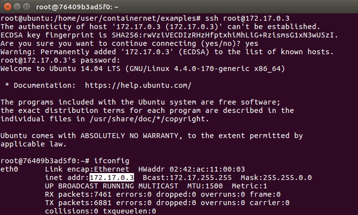
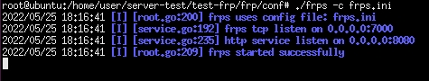

## Dockernet、Frp、ssh tunnel
### 1. Dockernet
#### 使用老師提供的虛擬機
* 下載[這個虛擬機](https://csie.nqu.edu.tw/smallko/mininet-wifidockerp4.zip)。   
* 輸入`mn`看顯示是不是containernet。   
   
  * 如果不是containernet，執行指令安裝   
  ```
  cd /home/user/containernet
  python3 ./setup.py install
  ```
* `docker images`查看有沒有ubuntu/trusty。   
   
  * 沒有的話執行`docker pull ubuntu:trusty`抓下來。   
#### 創建程式
* 進入containernet/examples資料夾，創建dockerhost1.py。   
```
#!/usr/bin/python

"""
This example shows how to create a simple network and
how to create docker containers (based on existing images)
to it.
"""

from mininet.net import Containernet
from mininet.node import Controller, Docker, OVSSwitch
from mininet.cli import CLI
from mininet.log import setLogLevel, info
from mininet.link import TCLink, Link


def topology():

    "Create a network with some docker containers acting as hosts."

    net = Containernet()

    info('*** Adding hosts\n')
    h1 = net.addHost('h1',  ip='10.0.0.250/24')

    info('*** Adding docker containers\n')
    d1 = net.addDocker('d1', ip='10.0.0.251/24', dimage="ubuntu:trusty")
    
    info('*** Creating links\n')
    net.addLink(h1, d1) 
  
    info('*** Starting network\n')
    net.start()

    info('*** Running CLI\n')
    CLI(net)

    info('*** Stopping network')
    net.stop()

if __name__ == '__main__':
    setLogLevel('info')
    topology()
```   
會準備兩個節點：h1、d1。h1是mininet host，IP是10.0.0.250；d1是docker host，IP是10.0.0.251，兩個節點會連起來。   
* `python3 dockerhost1.py`執行它，xterm開啟h1，另外再開啟一個terminal用來開啟d1。   
* terminal2輸入`docker ps`查看docker名稱，再執行`docker exec -it {名稱} bash`進入d1，查看IP是不是10.0.0.251。   
   
* `exit`離開當前d1，`docker run -it ubuntu:trusty bash`載入新環境。   
* 執行`apt update`更新環境。   
* 安裝套件   
```
apt install openssh-server -y
apt install apache2 -y
apt install vim -y
```
* `vim /etc/ssh/sshd_config`進行編輯，因為預設的環境，ssh不允許root進行遠端登入。   
* 進入編輯環境後輸入`/PermitRoot`搜尋關鍵字，按下a開始編輯，編輯完案esc輸入:wq儲存。   
   
* 執行`/etc/init.d/ssh start`並查看IP。   
   
* `passwd root`輸入密碼。   
* 回到最一開始的第一個terminal，執行`ssh root@172.17.0.3`連線，連進去後可以看看IP。   
   
* 回去terminal2執行`/etc/init.d/apache2 start`並確認狀態。   
   
* 到`cd /var/www/html`輸入`echo hi > hi.htm`。   
* 回到terminal1 exit後執行`curl 172.17.0.3/hi.htm`就可以看到hi。   
   
* 輸入`docker ps`查看ID(每個人ID不一樣)，取前三碼製作新的鏡像`docker commit 764 ubuntu:1.0`。   
   
* 回到terminal2`exit`離開鏡像並將舊鏡像刪除`docker rm -f 764`。   
   
* `docker images`查看剛剛建立的新的鏡像。   
   
* 回到dockerhost1.py，把trusty改成1.0，把剛剛做實驗的指令也加進去。   
   
* 測試dockerhost1.py，`python3 dockerhost1.py`，再執行`h1 ssh root@10.0.0.251`，如果出現錯誤，就執行提示的指令(最前面加上h1)即可。   
   
* 連進去以後exit離開，換測試阿帕契，`h1 curl 10.0.0.251/hi.htm`。
   

---
### 2. frp
   
左半邊是私有網路，可以想成是在家或是公司；右半邊就是外面的網路。在h1可以連到h2、h3，但h2、h3就沒辦法連進去h1，想連進去的話有幾種方法，第一種是port forwarding(DNAT)，就是r1打開一個端口，讓這個端口傳送封包到裡面去；第二種方法就是frp，意思是在外面網路找一台機器部屬frp server，在h1上安裝frp client，讓h1跟frp server進行連線，當外面的主機連到frp server的時候，server就會透過連線把請求抓到私有網路裡再回傳回去。   
#### 程式碼
* 移動到`root@ubuntu:/home/user/server-test/test-frp#`，程式碼(test.py)在這。   
```
#!/usr/bin/python
from mininet.net import Mininet
from mininet.link import Link, TCLink
from mininet.cli import CLI
from mininet.log import setLogLevel
 
def topology():
    "Create a network."
    net = Mininet()
 
    print ("*** Creating nodes")
    h1 = net.addHost( 'h1', ip="192.168.1.1/24") #private server
    h2 = net.addHost( 'h2', ip="1.1.1.1/24") #public server
    h3 = net.addHost( 'h3', ip="2.2.2.2/24") #public node
    r1 = net.addHost( 'r1')
    r2 = net.addHost( 'r2')
 
    ####  h1 --- r1 ---r2----h3
    ####               |
    ####               h2
 
    print ("*** Creating links")
    net.addLink(h1, r1)
    net.addLink(r1, r2)
    net.addLink(r2, h2)
    net.addLink(r2, h3)
 
    print ("*** Starting network")
    net.build()
 
    print ("*** Running CLI")
    r1.cmd("echo 1 > /proc/sys/net/ipv4/ip_forward")
    r2.cmd("echo 1 > /proc/sys/net/ipv4/ip_forward")
    r1.cmd("ifconfig r1-eth0 0")
    r1.cmd("ifconfig r1-eth1 0")
    r2.cmd("ifconfig r2-eth0 0")
    r2.cmd("ifconfig r2-eth1 0")
    r2.cmd("ifconfig r2-eth2 0")
    r1.cmd("ip addr add 192.168.1.254/24 brd + dev r1-eth0")
    r1.cmd("ip addr add 12.1.1.1/24 brd + dev r1-eth1")
    r2.cmd("ip addr add 12.1.1.2/24 brd + dev r2-eth0")
    r2.cmd("ip addr add 1.1.1.254/24 brd + dev r2-eth1")
    r2.cmd("ip addr add 2.2.2.254/24 brd + dev r2-eth2")
    h1.cmd("ip route add default via 192.168.1.254")
    h2.cmd("ip route add default via 1.1.1.254")
    h3.cmd("ip route add default via 2.2.2.254")
    r2.cmd("ip route add 12.1.1.0/24 via 12.1.1.1")
    r1.cmd("ip route add 1.1.1.0/24 via 12.1.1.2")
    r1.cmd("ip route add 2.2.2.0/24 via 12.1.1.2")
    r1.cmd("iptables -t nat -A POSTROUTING -s 192.168.1.0/24 -o r1-eth1 -j MASQUERADE")
 
    CLI( net )
 
    print ("*** Stopping network")
    net.stop()
 
if __name__ == '__main__':
    setLogLevel( 'info' )
    topology()
```
在test.py裡面，在h1跑網頁伺服器以及frp client，把r1的router及NAT功能打開，開NAT是因為要模擬h1是私有網路。test.py的`r1.cmd("iptables -t nat -A POSTROUTING -s 192.168.1.0/24 -o r1-eth1 -j MASQUERADE")`設定NAT很重要：用NAT的表格，在POSTROUTING之後，只要從192.168.1.0出來的，輸出的介面是從r1-eth1輸出，就把它進行來源位置變更。   
#### 執行
* 啟動
```
python test.py
```
* 開啟兩個h1、一個h2、一個h3
```
xterm h1 h1 h2 h3
```
* 在一個h1準備一個網頁，並啟動網頁伺服器
```
echo h1 > hi.htm
python -m SimpleHTTPServer 80
```
* h2(外網)啟動frp server，先進入frp資料夾，再進去conf(configuration)執行配置檔。
```
cd frp
cd conf
./frps -c frps.ini        # -c：指定配置檔
```
可以看到frps.ini如下，h2(frp server)跑一個7000的port，frp client要連過來的時候要告訴它連7000的port；h2再開一個8080，h3連到8080的時候，就會幫資料流量透過建立好的連線把東西傳進h1的http伺服器。如果內部伺服器還有其它的端口，那就在裡面繼續加。   
   
配置檔執行起來會看到7000跟8080端口已啟動。   
   
* 另一個h1也進去frp/conf裡面，這次使用frpc.ini。
```
cd frp
cd conf
./frps -c frpc.ini
```
frpc.ini如下，common為一般配置，必須指明arp server在哪(IP 1.1.1.1 / Port 7000)，提供一個http服務(在80端口)。別人連進來的時候，需要他用網域名稱連而不是IP，所以告訴他網域叫做www.example.com。   
   
* 告訴h3說等等要連的IP是1.1.1.1，網域名稱是www.example.com。
```
cat /etc/hosts
```
   
* h3連線
```
curl www.example.com:8080/hi.htm
```
   

---
### 3. ssh通道傳輸
#### 用途
在ssh通道裡面進行傳輸，即使外面的人抓到內容，也只會抓到有加密過的，資料就安全：也就是用來保護傳統沒有加密的資料，可以讓那些資料在通道裡面進行傳輸。   
#### 執行
* 移動到`/home/user/server-test/test-sshtunnel`裡面
* 修改`1.py`   
   
* 啟動
```
python3 1.py
```
* 開一個h1
```
xterm h1
```
* 再開啟一個terminal   
   
* 進入su連進去docker裡面，並啟動ssh伺服器及網頁伺服器
```
docker exec -it mn.d1 bash
/etc/init.d/ssh start
/etc/init.d/apache2 start
```
   
* 回去第一個terminal再開一個h1，並開啟wireshark對h1-eth0監聽。   
* 另一個h1去連線hi.htm
```
curl 192.168.0.2/hi.htm
```
* wireshark查看會看到顯示明文   
   
#### 使用ssh tunnel連線
* 回到h1執行指令，路由就會建立起來。如果出現登入錯誤，就按照之前的方法把key移除。
  * `-N`：不要執行遠程命令，也就是不進入遠端主機終端。
  * `-f`：讓ssh背景執行。
  * `-L 192.168.0.1:5555:192.168.0.2:80`：L為本地端。在本地主機開啟port 5555，跟ssh(port 22)建立連線。如果有資料傳進本地的port 5555，就傳進ssh(port 22)建立的連線，並傳給192.168.0.2:80。
  * `root@192.168.0.2`：以root登入遠端主機。
```
ssh -Nf -L 192.168.0.1:5555:192.168.0.2:80 root@192.168.0.2
```
* h1執行指令
```
netstat -tunIp | grep 5555
```
在本地端就會看到有建立好一個隧道   
   
* 回到wireshark重新抓封包
* 再回到h1再次連線
```
curl 192.168.0.1:5555/hi.htm
```
   
* 再去wireshark看，會看到封包都是加密的了。   
   

---