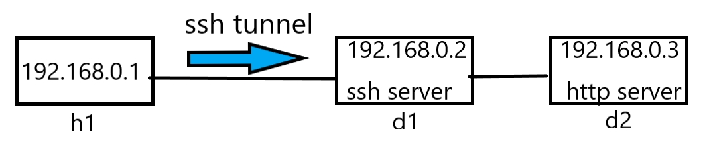
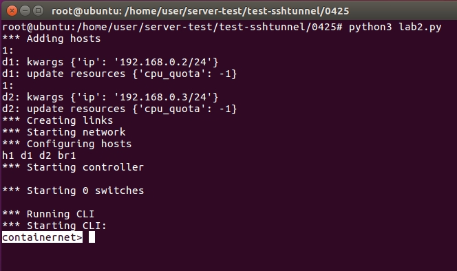
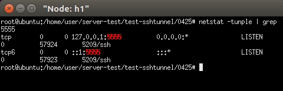
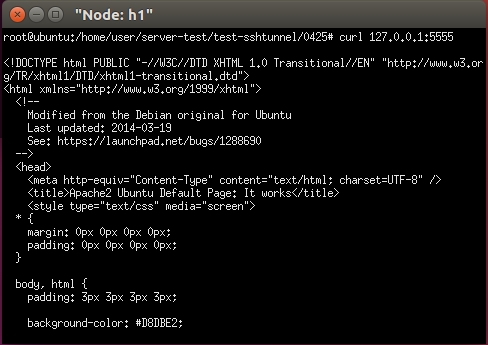
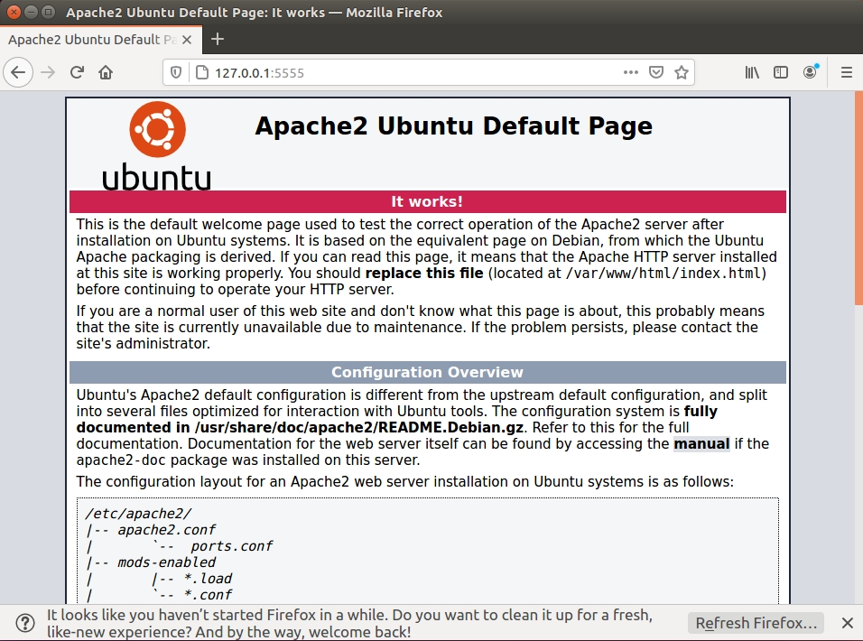
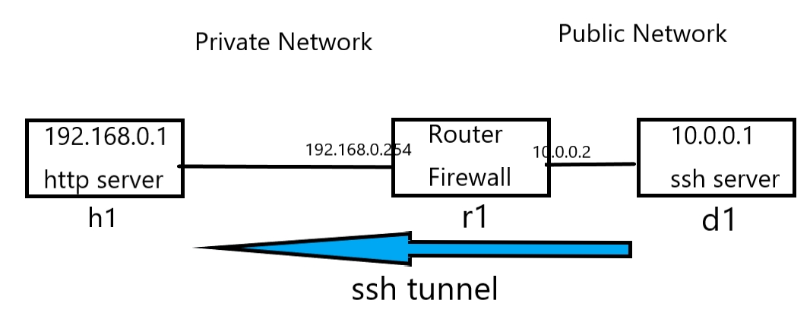
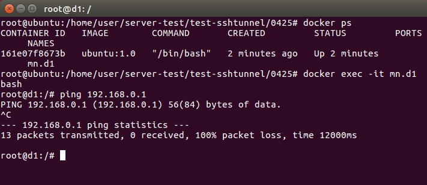
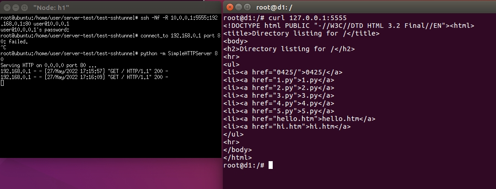
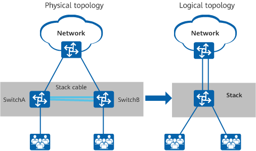

## ssh tunnel 、 Remote Port Forwarding
### 1. ssh tunnel Part2
假如192.168.0.1是公司內部網路，192.168.0.2是網際網路(或是自己家設置)的某一台伺服器(public IP)，在公司網路透過翻牆技術(ssh tunnel)翻到公開網路，跳過來後再從192.168.0.2去連外面的世界(192.168.0.3)。因為公司那邊可能會設很多防火牆，沒辦法瀏覽很多東西，所以就可以用這招。   
   
#### 實驗
程式碼lab2.py   
```
#!/usr/bin/python
from mininet.net import Containernet
from mininet.node import Docker
from mininet.cli import CLI
from mininet.log import setLogLevel, info
from mininet.link import TCLink, Link
 
def topology():
 
    "Create a network with some docker containers acting as hosts."
    net = Containernet()
 
    info('*** Adding hosts\n')
    h1 = net.addHost('h1', ip='192.168.0.1/24')
    d1 = net.addDocker('d1', ip='192.168.0.2/24', dimage="ubuntu:1.0")
    d2 = net.addDocker('d2', ip='192.168.0.3/24', dimage="ubuntu:1.0")
    br1 = net.addHost('br1')
 
    info('*** Creating links\n')
    net.addLink(h1, br1)
    net.addLink(d1, br1)
    net.addLink(d2, br1)
   
    info('*** Starting network\n')
    net.start()
    d1.cmd("/etc/init.d/ssh start")
    d2.cmd("/etc/init.d/apache2 start")
    d2.cmd("iptables -A INPUT -s 192.168.0.1 -j DROP")
    br1.cmd("ifconfig br1-eth0 0")
    br1.cmd("ifconfig br1-eth1 0")
    br1.cmd("ifconfig br1-eth2 0")
    br1.cmd("brctl addbr br1")
    br1.cmd("brctl addif br1 br1-eth0")
    br1.cmd("brctl addif br1 br1-eth1")
    br1.cmd("brctl addif br1 br1-eth2")
    br1.cmd("ifconfig br1 up") 
 
    info('*** Running CLI\n')
    CLI(net)
 
    info('*** Stopping network')
    net.stop()
 
if __name__ == '__main__':
    setLogLevel('info')
    topology()
```
* `d2.cmd("iptables -A INPUT -s 192.168.0.1 -j DROP")`：如果是從192.168.0.1直接連過來的就直接拒絕。就是用來模仿內部網路的防火牆，不讓裡面的機器可以直接連。   
* 啟動   
```
python3 lab2.py
```
一定要執行dockernet   
   
* 開啟h1   
```
xterm h1
```
* h1 curl d2
```
curl 192.168.0.3
```
這時候是不會有任何東西的，因為被擋住了。   
#### 建立通道
* h1輸入
```
ssh -Nf -L 5555:192.168.0.3:80 root@192.168.0.2
```
* 查看連線
```
netstat -tunple | grep 5555
```
   
* 使用curl再抓一次   
```
curl 127.0.0.1:5555
```
   
* 用firefox開啟，在網址輸入`127.0.0.1:5555`，這樣看更清楚。要先切換成一般使用者，因為firefox不允許超級使用者執行。   
```
su user
firefox
```
   

---
### 2. Remote Port Forwarding
   
之前實驗是內部翻牆翻出去，這個是外部翻牆翻進來。假設內部是公司電腦，外面是自己家電腦，因為外面的人沒辦法直接連到裡面，所以可以先在內網建立一個連線連到ssh server，再反向建立一個通道進去，在家就可以反向存取公司內部的機器。   
#### 實驗
* 使用lab3.py   
```
#!/usr/bin/python
from mininet.net import Containernet
from mininet.node import Docker
from mininet.cli import CLI
from mininet.log import setLogLevel, info
from mininet.link import TCLink, Link
 
def topology():
 
    "Create a network with some docker containers acting as hosts."
    net = Containernet()
 
    info('*** Adding hosts\n')
    h1 = net.addHost('h1', ip='192.168.0.1/24')
    r1 = net.addHost('r1', ip='192.168.0.254/24')
    d1 = net.addDocker('d1', ip='10.0.0.1/24', dimage="ubuntu:1.0")
 
    info('*** Creating links\n')
    net.addLink(h1, r1)
    net.addLink(r1, d1)
   
    info('*** Starting network\n')
    net.start()
    d1.cmd("/etc/init.d/ssh start")
    r1.cmd("ifconfig r1-eth1 0")
    r1.cmd("ip addr add 10.0.0.2/24 brd + dev r1-eth1")
    r1.cmd("echo 1 > /proc/sys/net/ipv4/ip_forward")
    r1.cmd("iptables -t nat -A POSTROUTING -s 192.168.0.0/24 -o r1-eth1 -j MASQUERADE")
    h1.cmd("ip route add default via 192.168.0.254")
    h1.cmd("python -m SimpleHTTPServer 80 &") 
 
    info('*** Running CLI\n')
    CLI(net)
 
    info('*** Stopping network')
    net.stop()
 
if __name__ == '__main__':
    setLogLevel('info')
    topology()
```
* 啟動   
```
python3 lab3.py
```
* 再開一個terminal進入d1裡面，並ping 192.168.0.1   
```
docker exec -it mn.d1 bash
ping 192.168.0.1
```
現在是ping不到的。   
   
#### 建立通道
* 回到containernet啟動h1
```
xterm h1
```
* h1輸入
```
ssh -Nf -R 10.0.0.1:5555:192.168.0.1:80 user@10.0.0.1
python -m SimpleHTTPServer 80
```
* 上面的`-R`：Reverse反向。   
* 回到d1使用curl
```
curl 127.0.0.1:5555
```
抓成功了   
   
#### 專有名詞小補充
1. `極縮比`：假設有一台交換機或是路由器，上面有一條2M的線路，分給下面的客戶。如果客戶只有一個，極縮比就是1:1；如果客戶有四個，極縮比就是1:4。只有一個客戶在使用網路的話，他就自己使用2M的網路；如果有多個客戶同時使用，他們就要平分那個網路。對廠商來說，極縮比越高，就越賺錢，因為提供的網路是一樣的，使用者越多就收越多錢。   
2. `PT`：Penetration Test滲透測試。簡單來說就是檢查這個網路有沒有漏洞(White Hat)。   
3. `Stacking`：堆疊。可以把實際的機器透過堆疊技術，讓它邏輯上變成一台。假如一台機器只有24個口，兩台機器透過堆疊堆在一起就變成48個口可以用，用來管理也可以當作管理一台機器。   
   

---