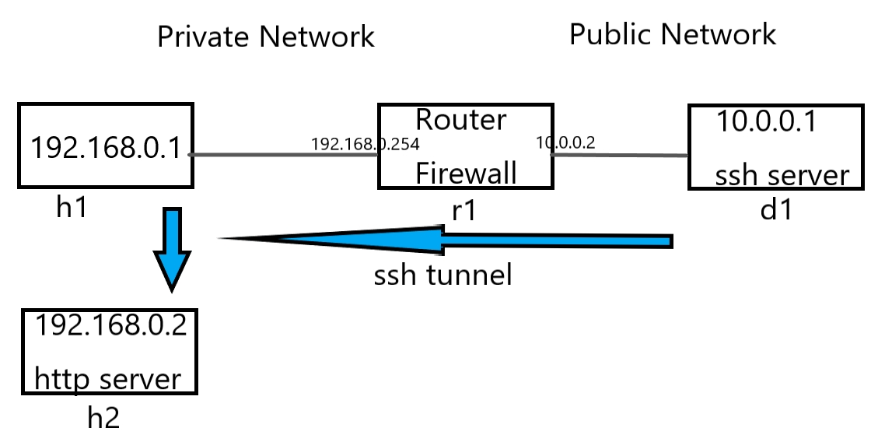

##
### 1. 
內部網路的部分，有可能伺服器是架在h2。也就是要從家裡通過通道先連到自己辦公室的電腦，再用它跳接到其它伺服器進行存取。   
   
#### 實驗
* 程式碼lab4.py   
因為裡面要建立一個內部網路，所以裡面會放一個br，它會連到r1、h1、h2。   
```
#!/usr/bin/python
from mininet.net import Containernet
from mininet.node import Docker
from mininet.cli import CLI
from mininet.log import setLogLevel, info
from mininet.link import TCLink, Link
 
def topology():
 
    "Create a network with some docker containers acting as hosts."
    net = Containernet()
 
    info('*** Adding hosts\n')
    h1 = net.addHost('h1', ip='192.168.0.1/24')
    h2 = net.addHost('h2', ip='192.168.0.2/24')
    br1 = net.addHost('br1')
    r1 = net.addHost('r1', ip='192.168.0.254/24')
    d1 = net.addDocker('d1', ip='10.0.0.1/24', dimage="ubuntu:1.0")
 
    info('*** Creating links\n')
    net.addLink(h1, br1)
    net.addLink(h2, br1)
    net.addLink(r1, br1)
    net.addLink(r1, d1)
    
    info('*** Starting network\n')
    net.start()
    d1.cmd("/etc/init.d/ssh start")
    r1.cmd("ifconfig r1-eth1 0")
    r1.cmd("ip addr add 10.0.0.2/24 brd + dev r1-eth1")
    r1.cmd("echo 1 > /proc/sys/net/ipv4/ip_forward")
    r1.cmd("iptables -t nat -A POSTROUTING -s 192.168.0.0/24 -o r1-eth1 -j MASQUERADE")
    h1.cmd("ip route add default via 192.168.0.254")
    br1.cmd("ifconfig br1-eth0 0")
    br1.cmd("ifconfig br1-eth1 0")
    br1.cmd("ifconfig br1-eth2 0")
    br1.cmd("brctl addbr br1")
    br1.cmd("brctl addif br1 br1-eth0")
    br1.cmd("brctl addif br1 br1-eth1")
    br1.cmd("brctl addif br1 br1-eth2")
    br1.cmd("ifconfig br1 up") 
 
    info('*** Running CLI\n')
    CLI(net)
 
    info('*** Stopping network')
    net.stop()
 
if __name__ == '__main__':
    setLogLevel('info')
    topology()
```
* 啟動
```
python3 lab4.py
```
* 開啟h1 h2
```
xterm h1 h2
```
* h2啟動網頁伺服器
```
python -m SimpleHTTPServer 80
```
* h1先連到d1，建立一個反向通道回來，再跳接到h2。在h1輸入   
```
ssh -Nf -R 10.0.0.1:5555:192.168.0.2:80 user@10.0.0.1
```
* 再開啟一個terminal進入d1並curl
```
docker exec -it mn.d1 bash
curl 127.0.0.1:5555
```
   
公司對外開放的埠號不一定是22號，所以對於ssh server也要開在不同號碼，登入的時候可以加上參數`-p`。   
```
ssh root@192.168.1.1 -p25
```

---
### 2. 
之前翻牆實驗只能綁定特定一台主機跟一個埠號，
   