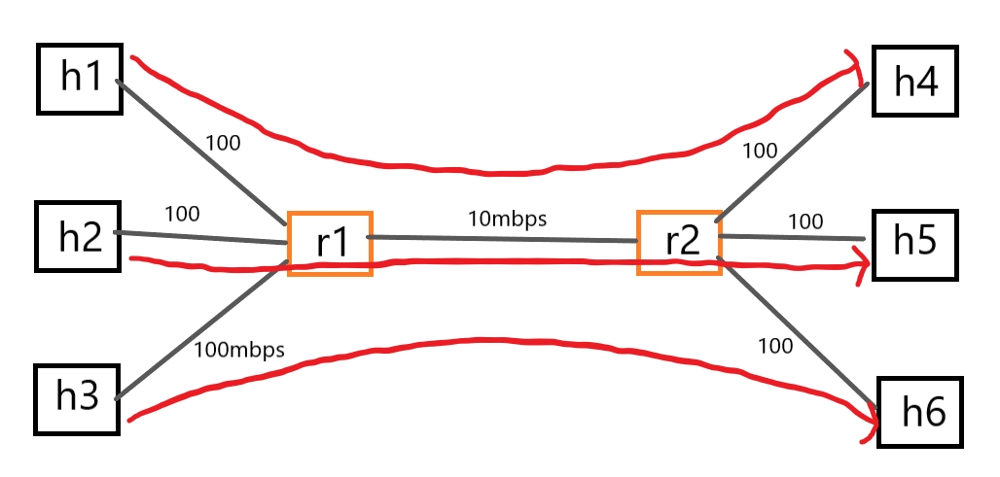

## 期中
### 1. h1 ping h2，但要從上面的路徑來回。
   
```
#!/usr/bin/python

from mininet.cli import CLI
from mininet.net import Mininet
from mininet.link import Link, TCLink, Intf

if '__main__'==__name__:
    net = Mininet(link = TCLink)
    h1 = net.addHost('h1')
    h2 = net.addHost('h2')
    r1 = net.addHost('r1')
    r2 = net.addHost('r2')
    r3 = net.addHost('r3')

    Link(h1, r1)
    Link(r1, r2)
    Link(r1, r3)
    Link(r3, r2)
    Link(r3, h2)
    net.build()
    
    h1.cmd("ifconfig h1-eth0 0")
    h1.cmd("ip addr add 192.168.1.1/24 brd + dev h1-eth0")

    r1.cmd("ifconfig r1-eth0 0")
    r1.cmd("ip addr add 192.168.1.2/24 brd + dev r1-eth0")
    r1.cmd("ifconfig r1-eth1 0")
    r1.cmd("ip addr add 192.168.2.1/24 brd + dev r1-eth1")
    r1.cmd("ifconfig r1-eth2 0")
    r1.cmd("ip addr add 192.168.3.1/24 brd + dev r1-eth2")

    r2.cmd("ifconfig r2-eth0 0")
    r2.cmd("ip addr add 192.168.2.2/24 brd + dev r2-eth0")
    r2.cmd("ifconfig r2-eth1 0")
    r2.cmd("ip addr add 192.168.4.1/24 brd + dev r2-eth1")

    r3.cmd("ifconfig r3-eth0 0")
    r3.cmd("ip addr add 192.168.3.2/24 brd + dev r3-eth0")
    r3.cmd("ifconfig r3-eth1 0")
    r3.cmd("ip addr add 192.168.4.2/24 brd + dev r3-eth1")
    r3.cmd("ifconfig r3-eth2 0")
    r3.cmd("ip addr add 192.168.5.2/24 brd + dev r3-eth2")

    h2.cmd("ifconfig h2-eth0 0")
    h2.cmd("ip addr add 192.168.5.1/24 brd + dev h2-eth0")

    h1.cmd("ip route add default via 192.168.1.2")
    h2.cmd("ip route add default via 192.168.5.2")
    r1.cmd("ip route add 192.168.5.0/24 via 192.168.2.2")
    r2.cmd("ip route add 192.168.5.0/24 via 192.168.4.2")
    r2.cmd("ip route add 192.168.1.0/24 via 192.168.2.1")
    r3.cmd("ip route add 192.168.1.0/24 via 192.168.4.1")
    
    r1.cmd("echo 1 > /proc/sys/net/ipv4/ip_forward")
    r2.cmd("echo 1 > /proc/sys/net/ipv4/ip_forward")
    r3.cmd("echo 1 > /proc/sys/net/ipv4/ip_forward")

    CLI(net)
    net.stop()
```   
   
   

---
### 2.
   
```
#!/usr/bin/python

from mininet.cli import CLI
from mininet.net import Mininet
from mininet.link import Link, TCLink, Intf

if '__main__'==__name__:
  net= Mininet(link=TCLink)
  h1 = net.addHost('h1')
  h2 = net.addHost('h2')
  h3 = net.addHost('h3')
  h4 = net.addHost('h4')
  br0 = net.addHost('br0')
  br1 = net.addHost('br1')

  Link(h1, br0)
  Link(h2, br0)
  Link(h3, br1)
  Link(h4, br1)
  Link(br0, br1)
  net.build()

  br0.cmd("ifconfig br0-eth0 0")
  br0.cmd("ifconfig br0-eth1 0")

  br0.cmd("vconfig add br0-eth2 10")
  br0.cmd("vconfig add br0-eth2 20")

  br0.cmd("brctl addbr mybr10")
  br0.cmd("brctl addbr mybr20")
  br0.cmd("brctl addif mybr10 br0-eth0")
  br0.cmd("brctl addif mybr20 br0-eth1")
  br0.cmd("brctl addif mybr10 br0-eth2.10")
  br0.cmd("brctl addif mybr20 br0-eth2.20")

  br0.cmd("ifconfig br0-eth2.10 up")
  br0.cmd("ifconfig br0-eth2.20 up")
  
  br1.cmd("ifconfig br1-eth0 0")
  br1.cmd("ifconfig br1-eth1 0")

  br1.cmd("vconfig add br1-eth2 10")
  br1.cmd("vconfig add br1-eth2 20")

  br1.cmd("brctl addbr mybr10")
  br1.cmd("brctl addbr mybr20")
  br1.cmd("brctl addif mybr10 br1-eth0")
  br1.cmd("brctl addif mybr20 br1-eth1")
  br1.cmd("brctl addif mybr10 br1-eth2.10")
  br1.cmd("brctl addif mybr20 br1-eth2.20")

  br1.cmd("ifconfig br1-eth2.10 up")
  br1.cmd("ifconfig br1-eth2.20 up")

  br0.cmd("ifconfig mybr10 up")
  br0.cmd("ifconfig mybr20 up")
  br1.cmd("ifconfig mybr10 up")
  br1.cmd("ifconfig mybr20 up")
  CLI(net)
  net.stop()
```

---
### 3. 使用iperf tcp去量測那三條資料流的throughput，並用gnuplot畫出來。
   
```
#!/usr/bin/python

from mininet.cli import CLI
from mininet.net import Mininet
from mininet.link import Link, TCLink, Intf

if '__main__'==__name__:
    net = Mininet(link = TCLink)
    h1 = net.addHost('h1')
    h2 = net.addHost('h2')
    h3 = net.addHost('h3')
    h4 = net.addHost('h4')
    h5 = net.addHost('h5')
    h6 = net.addHost('h6')
    r1 = net.addHost('r1')
    r2 = net.addHost('r2')

    h1r1 = {'bw':100,'delay':'1ms','loss':0}
    net.addLink(h1, r1, cls=TCLink , **h1r1)
    h2r1 = {'bw':100,'delay':'1ms','loss':0}
    net.addLink(h2, r1, cls=TCLink , **h2r1)
    h3r1 = {'bw':100,'delay':'1ms','loss':0}
    net.addLink(h3, r1, cls=TCLink , **h3r1)
    r1r2 = {'bw':10,'delay':'1ms','loss':0}
    net.addLink(r1, r2, cls=TCLink , **r1r2)
    r2h4 = {'bw':100,'delay':'1ms','loss':0}
    net.addLink(r2, h4, cls=TCLink , **r2h4)
    r2h5 = {'bw':100,'delay':'1ms','loss':0}
    net.addLink(r2, h5, cls=TCLink , **r2h5)
    r2h6 = {'bw':100,'delay':'1ms','loss':0}
    net.addLink(r2, h6, cls=TCLink , **r2h6)

    net.build()
    h1.cmd("ifconfig h1-eth0 0")
    h1.cmd("ip addr add 192.168.1.1/24 brd + dev h1-eth0")
    h2.cmd("ifconfig h2-eth0 0")
    h2.cmd("ip addr add 192.168.2.1/24 brd + dev h2-eth0")
    h3.cmd("ifconfig h3-eth0 0")
    h3.cmd("ip addr add 192.168.3.1/24 brd + dev h3-eth0")

    r1.cmd("ifconfig r1-eth0 0")
    r1.cmd("ip addr add 192.168.1.254/24 brd + dev r1-eth0")
    r1.cmd("ifconfig r1-eth1 0")
    r1.cmd("ip addr add 192.168.2.254/24 brd + dev r1-eth1")
    r1.cmd("ifconfig r1-eth2 0")
    r1.cmd("ip addr add 192.168.3.254/24 brd + dev r1-eth2")
    r1.cmd("ifconfig r1-eth3 0")
    r1.cmd("ip addr add 192.168.7.1/24 brd + dev r1-eth3")

    r2.cmd("ifconfig r2-eth0 0")
    r2.cmd("ip addr add 192.168.7.2/24 brd + dev r2-eth0")
    r2.cmd("ifconfig r2-eth1 0")
    r2.cmd("ip addr add 192.168.4.254/24 brd + dev r2-eth1")
    r2.cmd("ifconfig r2-eth2 0")
    r2.cmd("ip addr add 192.168.5.254/24 brd + dev r2-eth2")
    r2.cmd("ifconfig r2-eth3 0")
    r2.cmd("ip addr add 192.168.6.254/24 brd + dev r2-eth3")

    h4.cmd("ifconfig h4-eth0 0")
    h4.cmd("ip addr add 192.168.4.1/24 brd + dev h4-eth0")
    h5.cmd("ifconfig h5-eth0 0")
    h5.cmd("ip addr add 192.168.5.1/24 brd + dev h5-eth0")
    h6.cmd("ifconfig h6-eth0 0")
    h6.cmd("ip addr add 192.168.6.1/24 brd + dev h6-eth0")

    h1.cmd("ip route add default via 192.168.1.254")
    h2.cmd("ip route add default via 192.168.2.254")
    h3.cmd("ip route add default via 192.168.3.254")
    h4.cmd("ip route add default via 192.168.4.254")
    h5.cmd("ip route add default via 192.168.5.254")
    h6.cmd("ip route add default via 192.168.6.254")

    r1.cmd("ip route add default via 192.168.7.2")
    r2.cmd("ip route add default via 192.168.7.1")

    r1.cmd("echo 1 > /proc/sys/net/ipv4/ip_forward")
    r2.cmd("echo 1 > /proc/sys/net/ipv4/ip_forward")

    CLI(net)
    net.stop()
```   
gnuplot.plt   
```
plot "result1" with linespoints, "result2" with linespoints, "result3" with linespoints
set xlabel "time(sec)"
set ylabel "throughput(Mbps)"
set yrange [0:100]
set ytics 0,10,100
set xrange [1:50]
set xtics 0,10,50
set title "Three Lines TCP Flow Throughput"
set terminal gif
set output "results.gif"
replot
```   
* 執行3.py   
```
python 3.py
```
* 開啟每個host   
```
xterm h1 h2 h3 h4 h5 h6
```
* h4、h5、h6分別執行   
```
iperf -s -i 1 -p 6666 > result1-1
```
```
iperf -s -i 1 -p 7777 > result2-1
```
```
iperf -s -i 1 -p 8888 > result3-1
```
* h1、h2、h3分別執行
```
iperf -c 192.168.4.1 -t 50 -p 6666
```
```
iperf -c 192.168.5.1 -t 50 -p 7777
```
```
iperf -c 192.168.6.1 -t 50 -p 8888
```   
   
* 傳輸完成後再到h4、h5、h6分別輸入以下指令進行過濾   
```
cat result1-1 | grep "sec" | head -n 50 | tr "-" " " | awk '{print $4,$8}' > result1
```
```
cat result2-1 | grep "sec" | head -n 50 | tr "-" " " | awk '{print $4,$8}' > result2
```
```
cat result3-1 | grep "sec" | head -n 50 | tr "-" " " | awk '{print $4,$8}' > result3
```
* 最後退出回到終端執行gnuplot.plt輸出gif   
```
gnuplot gnuplot.plt
```
   

---
### 4. h1可用ssh連到d2，且可用curl到d1抓網頁。
    
```
#!/usr/bin/python
from mininet.net import Mininet
from mininet.link import Link, TCLink
from mininet.cli import CLI
from mininet.log import setLogLevel, info
from mininet.net import Containernet
from mininet.node import Controller, Docker, OVSSwitch

 
def topology():
    "Create a network."
    net = Containernet()
    h1 = net.addHost('h1', ip='192.168.1.1/24')
    r1 = net.addHost('r1')

    info('*** Adding docker containers\n')
    d1 = net.addDocker('d1', ip='192.168.2.1', dimage="ubuntu:1.0")
    d2 = net.addDocker('d2', ip='192.168.3.1', dimage="ubuntu:1.0")

    net.addLink(h1, r1)
    net.addLink(r1, d1)
    net.addLink(r1, d2)
    net.start()
 
    r1.cmd("echo 1 > /proc/sys/net/ipv4/ip_forward")
    r1.cmd("ifconfig r1-eth0 0")
    r1.cmd("ifconfig r1-eth1 0")
    r1.cmd("ifconfig r1-eth2 0")
    r1.cmd("ip addr add 192.168.1.254/24 brd + dev r1-eth0")
    r1.cmd("ip addr add 192.168.2.254/24 brd + dev r1-eth1")
    r1.cmd("ip addr add 192.168.3.254/24 brd + dev r1-eth2")

    h1.cmd("ip route add default via 192.168.1.254")
    d1.cmd("ip route add default via 192.168.2.254")
    d2.cmd("ip route add default via 192.168.3.254")

    r1.cmd("iptables -t nat -A POSTROUTING -s 192.168.1.0/24 -o r1-eth1 -j MASQUERADE")
    r1.cmd("iptables -t nat -A POSTROUTING -s 192.168.1.0/24 -o r1-eth2 -j MASQUERADE")

    d1.cmd("/etc/init.d/apache2 start")

    d2.cmd("/etc/init.d/ssh start")
 
    CLI(net)
    net.stop()
 
if __name__ == '__main__':
    setLogLevel( 'info' )
    topology()
```
* 執行程式   
```
python3 4.py
```
* 開啟h1   
```
xterm h1
```
* 新開啟一個terminal，進入d1並產生hi.htm   
```
docker exec -it mn.d1 bash
echo hi > hi.htm
```
* 回到h1 curl下來   
```
curl 192.168.2.1/hi.htm
```   
   
* 再開啟一個terminal，進入d2   
```
docker exec -it mn.d2 bash
```   
* 回到h1輸入指令   
```
ssh -Nf -L 192.168.1.1:5555:192.168.3.1:80 root@192.168.3.1
```
* 查看有沒有建立隧道   
```
netstat -tunple | grep 5555
```   
   

---